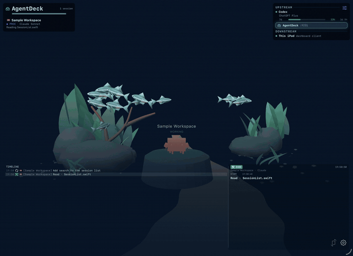

<p align="center">
  
</p>

# AgentDeck

<p align="center">
  <a href="https://apps.apple.com/app/id6784822497"></a>
  <a href="https://play.google.com/store/apps/details?id=dev.agentdeck"></a>
  <a href="https://marketplace.elgato.com/product/agentdeck-dce3806b-176e-40f2-be7d-e029bec0f464"></a>
  <a href="https://ugc.ulanzistudio.com/contentView/1141"></a>
  <a href="LICENSE"></a>
  <a href="https://www.npmjs.com/package/@agentdeck/setup"></a>
  <a href="https://github.com/puritysb/AgentDeck/actions/workflows/ci.yml"></a>
  <a href="https://puritysb.github.io/AgentDeck/"></a>
</p>

**Your coding agents, at a glance.**

AgentDeck shows which agents are working, waiting for you, or finished—across
projects and tools. Watch them in a living aquarium, follow the timeline, and
keep usage limits in view. Use your Mac or terminal on its own, or add a tablet,
Stream Deck, e-ink reader, or small desk display.

<p align="center">
  <a href="https://puritysb.github.io/AgentDeck/#aquarium"></a>
</p>

<p align="center">
  <a href="https://puritysb.github.io/AgentDeck/#aquarium"><strong>▶ Watch the aquarium demo</strong></a>
  &nbsp;·&nbsp;
  <a href="https://puritysb.github.io/AgentDeck/"><strong>🌊 Project website</strong></a>
  &nbsp;·&nbsp;
  <a href="https://puritysb.github.io/AgentDeck/hardware/">Devices</a>
  &nbsp;·&nbsp;
  <a href="https://puritysb.github.io/AgentDeck/demo/">Live preview</a>
  &nbsp;·&nbsp;
  <a href="https://puritysb.github.io/AgentDeck/design-system/">Design system</a>
</p>

## A dashboard that feels alive

Choose the familiar dashboard or the **native 3D aquarium** on Mac, iPhone/iPad,
and Android LCD devices. Each session becomes a creature; its activity changes
its movement, and nearby fish react. On mobile, tap empty water to hide the
panels and move closer. Tap again to return. Existing preferences are preserved.

The demo follows a fictional coding task in the real native app: agents join,
edit code, run tests, wait for permission, and finish. No private workspace data
is shown. [Watch the high-resolution story](https://puritysb.github.io/AgentDeck/#aquarium)
or take the [hardware desk tour](https://youtu.be/s-f8ICBcC4o).

## What it does

- **Follow parallel work.** Session names, current tools, and a shared timeline
  explain what each agent is doing. Collaboration shows reported subagents,
  task relationships, and recent task history.
- **Notice when you are needed.** Permission and input requests stand out.
  Answer or interrupt from supported surfaces when the session provides a real
  control path; otherwise prompts are display-only.
- **Keep usage visible.** Claude, Codex, and z.ai/GLM gauges appear where the
  connected provider supplies usage data. Agent identity and model provider
  remain separate.
- **Choose your display.** The 3D scene keeps up to eight foreground residents
  readable while the roster retains every session. E-ink uses a static rendered
  backdrop and restrained motion; compact panels keep their focused layouts.

## Start here

**No extra hardware required.** Choose a native dashboard or the terminal path.

### Mac, iPhone, and iPad

[Install from the App Store](https://apps.apple.com/app/id6784822497).
The Mac app includes its own daemon and needs no Node.js. Enable your agent
integrations in Settings, then run your agents normally. iPhone/iPad pair with
an AgentDeck daemon on your network.

Requires macOS 26+ or iOS/iPadOS 17+. See the [Apple guide](docs/apple-app.md).

### Terminal, Windows, Linux, and external integrations

Requires Node.js **22, 24, or 26** and a supported agent on macOS 15+,
[Windows 11](docs/windows.md), or [Linux](docs/linux.md).

```bash
npx @agentdeck/setup
agentdeck daemon install   # refresh hooks and start observation
claude                     # or: codex · opencode · kiro-cli
```

In another terminal:

```bash
agentdeck dashboard        # live sessions, aquarium, usage, and timeline
```

<p align="center">
  
</p>

The Mac app can also attach to the CLI daemon for additional integrations,
including Claude subscription gauges and ADB device support.
[Compare capabilities](docs/appstore-feature-matrix.md).
For setup problems, run `agentdeck diag agents` or see
[installation](docs/install.md) and [troubleshooting](docs/troubleshooting.md).

<details>
<summary>Existing managed sessions and remote attach</summary>

`agentdeck claude`, `agentdeck codex`, `agentdeck opencode`, and
`agentdeck monitor` remain functional, with no removal date. Ordinary local
sessions should use the daemon with normal agent commands. Managed-only remote
attach, `--weight`, agent argument overrides, and terminal steering remain
available until replacements are validated. See the
[CLI reference](docs/cli.md),
[remote attach guide](docs/daemon.md#remote-attach-cross-machine-sessions), and
[migration discussion](https://github.com/puritysb/AgentDeck/discussions/278).

</details>

## Agents

| Agent | Observation |
|---|---|
| **Claude Code** | Lifecycle hooks; primary supported integration |
| **Codex CLI** | Lifecycle hooks and rollout logs |
| **Codex Desktop** | Observed on macOS; Windows verification pending |
| **OpenCode** | Observer plugin and native events |
| **Kiro CLI / IDE** | Transcript observation; delayed, idle-only activity |
| **Antigravity** | Passive observation through the CLI daemon |
| **OpenClaw** | Experimental Gateway integration |

Run agents normally; AgentDeck reads their native events rather than scraping
terminal screens. Kiro has no managed launcher, and the sandboxed Mac app needs
a one-time folder grant for its transcripts. Detailed setup and limitations:
[configuration](docs/configuration.md), [Apple guide](docs/apple-app.md), and
[Gateway guide](docs/gateway-protocol.md).

## Releases

### Compatibility and delivery channels

Use the channel for your device. Components with the same major version work
together: a 1.0 device can connect to a 1.5 daemon. Minor and patch versions
advance independently; you do not need to update every device together.

| Product | Install / update | Release tag |
|---|---|---|
| Mac · iPhone · iPad | [App Store](https://apps.apple.com/app/id6784822497) | `apple-v*` |
| Android tablets and e-ink | [Google Play](https://play.google.com/store/apps/details?id=dev.agentdeck) · [signed GitHub APK](https://github.com/puritysb/AgentDeck/releases?q=android-v&expanded=true) | `android-v1.5.0` |
| CLI + daemon | [`npx @agentdeck/setup`](https://www.npmjs.com/package/@agentdeck/setup) | `npm-v1.4.2` |
| Stream Deck / Mini / XL / Plus / + XL | [Elgato Marketplace](https://marketplace.elgato.com/product/agentdeck-dce3806b-176e-40f2-be7d-e029bec0f464) | `streamdeck-v*` |
| Ulanzi D200H / D200X LCD keys | [Ulanzi Marketplace](https://ugc.ulanzistudio.com/contentView/1141); D200X encoders are not supported | `ulanzi-v*` |
| ESP32 panels and TRMNL 7.5" | [Browser flasher](https://puritysb.github.io/AgentDeck/flash/) · [firmware releases](https://github.com/puritysb/AgentDeck/releases?q=esp32-v&expanded=true) | `esp32-v*` |

Mobile apps and hardware are companion surfaces: keep a daemon running on your
computer. Supported ESP32 boards offer Wi-Fi OTA after the first USB flash;
GitHub Android APKs offer wireless updates from Settings. Pixoo, TC001, Timebox,
and iDotMatrix setup is covered in the [device guide](docs/devices.md).

[Changelog](CHANGELOG.md) · [All releases](https://github.com/puritysb/AgentDeck/releases)
· [Release policy](RELEASING.md)

## What it looks like on real hardware

<table>
<tr>
<td width="50%"></td>
<td width="50%"></td>
</tr>
<tr><td><b>Stream Deck+</b> — session controls at your fingertips</td><td><b>E-ink</b> — a quiet view beside your work</td></tr>
</table>

[Browse all 29 surfaces](https://puritysb.github.io/AgentDeck/hardware/), including
ESP32 touch panels, TRMNL, LED matrices, tablets, and Ulanzi decks.

## Compatible Companion Projects

Independent integrations have their own releases and support. Both projects
below are **Community** integrations; listing does not imply verified compatibility.

- [Pocket Daily Reader](https://github.com/puritysb/pocket-daily-reader): an
  offline-first reader using the `portable-reader/v1` profile.
- [Bitfocus Companion module](https://github.com/houtacheng/companion-module-agentdeck)
  by [@houtacheng](https://github.com/houtacheng): session tiles, controls, and usage
  through `companion-control/v1`.

See the [Surface Protocol](docs/surface-protocol.md) for capabilities, runtime
status, integration manifests, and conformance levels.

## Documentation

**Start with the website** — [puritysb.github.io/AgentDeck](https://puritysb.github.io/AgentDeck/)
carries the rendered device catalog, live renderer previews, the design system, and
build health.

| | |
|---|---|
| **Using it** | [CLI reference](docs/cli.md) · [Configuration](docs/configuration.md) · [Troubleshooting](docs/troubleshooting.md) · [Windows](docs/windows.md) · [Linux](docs/linux.md) |
| **Surfaces** | [Hardware matrix](docs/hardware-compatibility.md) · [Stream Deck layout](docs/streamdeck-layout.md) · [Devices](docs/devices.md) · [ESP32](docs/esp32.md) · [Android](docs/android.md) · [Apple](docs/apple-app.md) · [TUI](docs/tui-dashboard.md) |
| **Internals** | [Architecture](docs/architecture.md) · [Surface protocol](docs/surface-protocol.md) · [Internal bridge protocol](docs/protocol.md) · [Daemon](docs/daemon.md) · [Gateway protocol](docs/gateway-protocol.md) · [Testing](docs/testing.md) |
| **Evaluation** | [Why APME](docs/why-apme.md) · [APME](docs/apme.md) · [Pipeline](docs/apme-pipeline.md) |
| **Design** | [DESIGN.md](DESIGN.md) · [Tokens](design/tokens.css) · [Resource map](design/RESOURCES.md) |
| **Project** | [Roadmap](docs/roadmap.md) · [Releasing](RELEASING.md) · [Changelog](CHANGELOG.md) · [Agent harness](docs/agent-harness.md) · [AI-assisted maintenance](docs/ai-assisted-maintenance.md) |

## Development

```bash
pnpm install && pnpm build
pnpm -r --parallel dev
pnpm test
```

[Build from source](docs/install.md) · [Testing](docs/testing.md) ·
[Build health](https://puritysb.github.io/AgentDeck/reports/).
Coding agents should start at [AGENTS.md](AGENTS.md) and [CLAUDE.md](CLAUDE.md).

## Community

Bug reports, hardware verification, documentation fixes, and focused pull
requests are welcome. Read [CONTRIBUTING.md](CONTRIBUTING.md), use
[SECURITY.md](SECURITY.md) for private vulnerability reports, and follow the
[Code of Conduct](CODE_OF_CONDUCT.md). See
[AI-assisted maintenance](docs/ai-assisted-maintenance.md) for how maintainers
review agent-assisted work.

## License & attribution

MIT — see [LICENSE](LICENSE).

Independent project. Not affiliated with Anthropic, OpenAI, Google, Elgato, DIVOOM,
or any other third party referenced here. All trademarks belong to their respective
owners. Full notices in [ATTRIBUTION.md](ATTRIBUTION.md).
