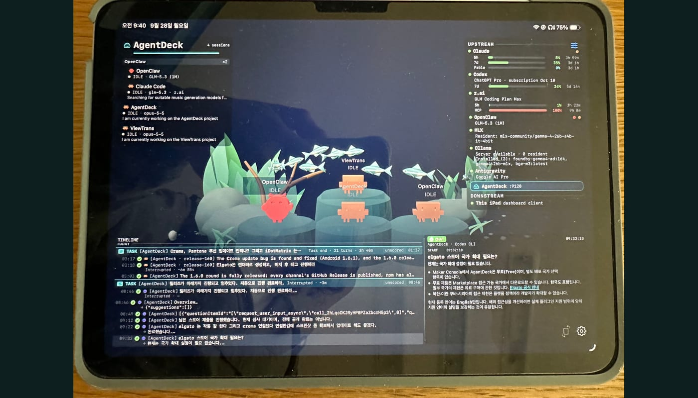
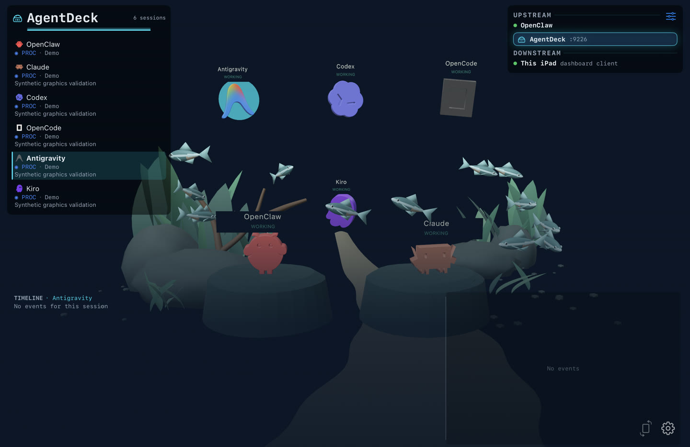
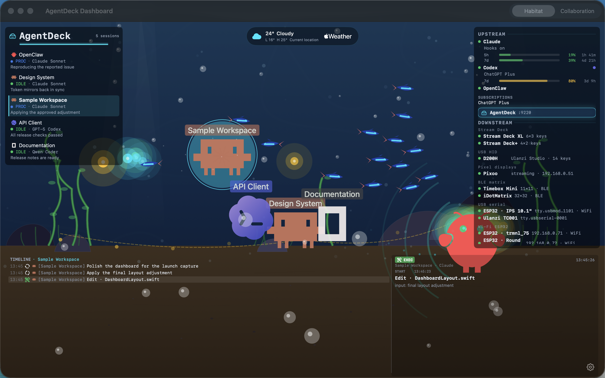
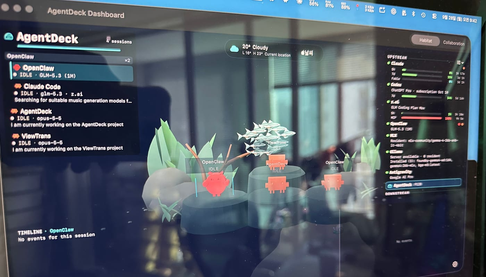
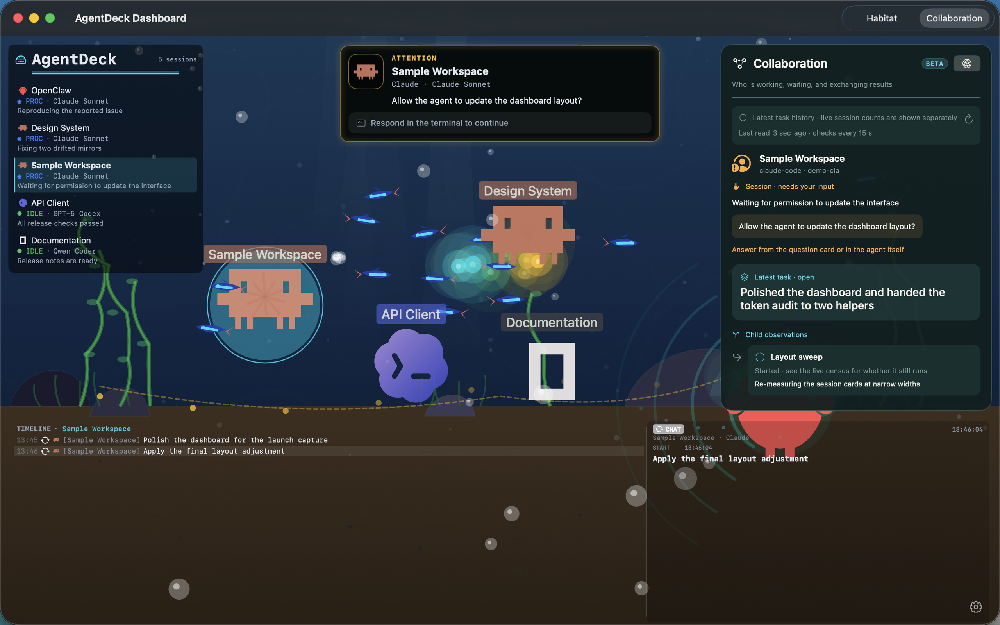
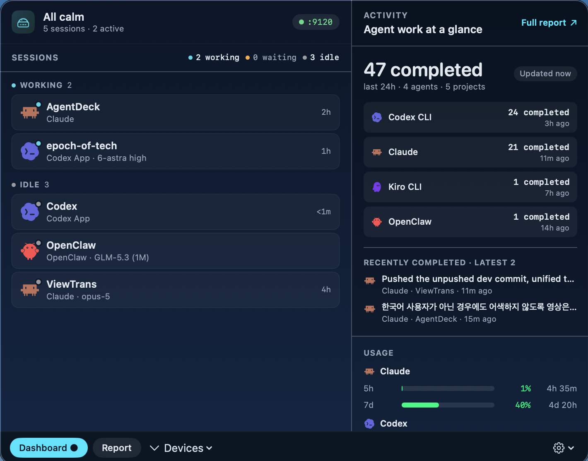

# Apple Dashboard

SwiftUI for iOS, iPadOS, and macOS. What ships in the App Store build versus the
terminal-managed daemon is tracked in
[appstore-feature-matrix.md](appstore-feature-matrix.md).

Monitor and control your AI agents from iPhone, iPad, or Mac — a native SwiftUI experience.

  

The Apple app is a SwiftUI multiplatform app that connects to the dashboard hub on iOS/iPadOS, and **on macOS ships with a standalone in-process Swift daemon** — mDNS, device modules (serial/Pixoo/Timebox/iDotMatrix), Gateway proxy, hook ingestion, and WebSocket server — so the macOS build monitors sessions without Node.js. You can still use the `agentdeck` CLI alongside it for Claude Code / Codex / OpenCode PTY sessions and CLI-only integrations; the app's daemon auto-detects and defers to a running CLI daemon on the same port.

## Choose your dashboard

In **Settings → Dashboard**, choose **Default** or **3D aquarium · Preview**.
Your saved choice is preserved across updates. The native 3D view uses the same
session data, usage information, and activity panels as the standard dashboard.
It requires iOS/iPadOS 18 or later; the standard view remains available on iOS 17.

On iPhone and iPad, tap empty water to enter viewing mode: panels and labels fade
away while the camera moves closer. Tap again to return. Reduce Motion removes
the camera transition. Up to eight foreground residents keep crowded scenes
readable; every session remains accessible in the roster. Decorative fish are
not additional agent sessions.

  

## macOS Dashboard Window

One window holds the whole desk: the session roster, the habitat, the timeline, and the
`UPSTREAM` / `DOWNSTREAM` rail that names every provider and every connected surface.

  

  

## Collaboration (Beta)

The Collaboration panel shows the selected session’s task, recent task history,
reported running subagents, and jobs being waited on. Use it to follow delegation
and handoffs without searching a transcript. These task records come from typed
coordination events; live session counts are shown separately because a running
session is not the same thing as a task or a completed handoff.

  

## Three-Tab Navigation

| Tab | Content |
|-----|---------|
| **Monitor** | Terrarium background + HUD overlay — agent status, rate limits, timeline |
| **Deck** | Stream Deck+ mirror — encoder panels + button grid with touch gestures |
| **Settings** | Bridge connection, display preferences |

## macOS Menu Bar Popup

On macOS the app always lives in the menu bar — one click reveals the full topology without taking over a window.

  

- **Sessions** — live session list with agent, state, and model; per-row Jump To buttons open the Pixoo view, the Stream Deck Code view, the full Dashboard window, or reveal the session data folder in Finder
- **Topology** — `UPSTREAM` (Claude Code hooks, OpenClaw Gateway, MLX, Ollama) and `DOWNSTREAM` (D200H, Pixoo, ESP32, Android) with LED dots driven by the shared `ProviderRailEvaluator`, so Settings / Dashboard / menu bar can never disagree about "is Claude connected?"
- **Tabs** — Launch · Dashboard · Evaluation switch the popup body without opening a window; a `Start at Login` toggle + `Quit` sit in the footer

## Connect to Bridge

- **mDNS** — automatic discovery of `_agentdeck._tcp` services on your local network
- **QR pairing** — scan with the in-app camera (`agentdeck qr` on your Mac)
- **Manual** — enter bridge IP and port

## iOS Foreground Recovery

The app handles iOS background/foreground transitions gracefully — WebSocket reconnects immediately on foregrounding, state syncs within milliseconds, and the terrarium animation resumes without flicker.

## Two-tier product: App Store app alone vs +CLI

AgentDeck is deliberately a two-tier product:

- **Tier 1 — the App Store app alone** is a complete monitoring dashboard. It installs Claude Code / Codex hooks itself (explicit NSOpenPanel consent), shows live session state and tool activity, flips a session to **"needs attention" + a macOS notification** when the agent genuinely waits for your response (you answer in your own terminal), optionally monitors an OpenCode server you run (`opencode serve`, Settings → Integrations), and drives all sandbox-reachable hardware (D200H, Pixoo, Timebox, iDotMatrix, ESP32) plus iPad pairing, voice input, and APME LLM evaluation.
- **Tier 2 — install the `agentdeck` CLI** (`npx @agentdeck/setup`) and the same app gains the PTY-powered extras: **steering** (answer Claude's real multi-choice prompts from the dashboard, Stream Deck, or D200H), Claude subscription usage gauges (5h/7d) and Codex credits, passive discovery of already-running sessions, Android/e-ink devices over ADB, and ESP32 firmware flashing. The app detects the CLI daemon automatically on port 9120 — no configuration; quit the daemon and the app seamlessly takes back over.

The upgrade story lives here and in [appstore-feature-matrix.md](appstore-feature-matrix.md) — the app itself never prompts you to install the CLI (App Review 4.2.3).

## App Store Distribution

Install [AgentDeck Dashboard from the App Store](https://apps.apple.com/app/id6784822497) on Mac, iPhone, or iPad. The Mac app runs the local hub; iPhone and iPad connect as companion dashboards. Updates are delivered through the App Store.

The macOS build ships as a **self-contained Swift daemon** gated by the `AGENTDECK_APP_STORE` compile flag — no bundled Node.js, no bundled `adb`, no subprocess spawn, no AppleScript. User data lives in the app sandbox container (`~/Library/Containers/bound.serendipity.agent.deck/Data/Library/Application Support/AgentDeck/`, not `~/.agentdeck/`) per Apple Review Guideline 2.5.2. D200H is reached only through the Ulanzi Studio WebSocket plugin, so AgentDeck requests no USB HID entitlement. The first-launch onboarding asks for Claude Code hook access via explicit NSOpenPanel consent. OpenClaw integration uses the Gateway-native WebSocket path (see §OpenClaw Gateway below), not a file-based identity. The app uses bundle ID `bound.serendipity.agent.deck`; see [RELEASING.md](../RELEASING.md) for independent channel delivery and build numbering.

## OpenClaw Gateway (Gateway-native pairing)

AgentDeck connects to the OpenClaw Gateway over WebSocket (`ws://127.0.0.1:18789`) as an operator client. Pairing uses two handshake formats so both distributions work:

- **Mac App Store build (v3 self-generated identity)**: on first launch AgentDeck generates an Ed25519 keypair and stores the private key in the macOS Keychain (`accessibleAfterFirstUnlockThisDeviceOnly`). `deviceId = sha256(raw 32-byte public key).hex`. The Gateway returns a `deviceToken` in `hello-ok.auth.deviceToken`; it's persisted and reused on reconnect. No file read of `~/.openclaw/identity/` — sandbox-safe per Apple 2.5.2. Default scopes: `operator.read`, `operator.write`, `operator.approvals`. To pair, run `openclaw devices approve <requestId>` (or use OpenClaw's Web UI) once; the dashboard flips from Pairing required → Connected.
- **CLI / Homebrew build (v2 file-based identity)**: reads `~/.openclaw/identity/device.json` created by `openclaw pair`, for historical parity with the Node bridge.

Both builds share the same RPC surface: `connect`, `health`, `models.list`, `logs.tail`, `sessions.list/subscribe`, `chat.send/abort`, `exec.approval.resolve`, `system-presence`. Events: `connect.challenge`, `health`, `sessions.changed`, `session.message/tool`, `chat`, `exec.approval.requested/resolved`, `presence`, `tick`, `shutdown`. All subprocess-based fallbacks (`openclaw doctor`, `openclaw logs --follow`, `openclaw models list`) are compile-out in the App Store build and replaced with Gateway RPCs. See [gateway-protocol.md](gateway-protocol.md) for wire format + parity fixtures.

Auth failures (`missing_token`, `pairing_required`, `token_mismatch`, `device_auth_invalid`) do **not** auto-loop; the Settings pairing-state UI surfaces each case so the user can resolve deliberately. Remote / TLS-pinned Gateway support is deferred to v2; v1 officially targets loopback.

---
