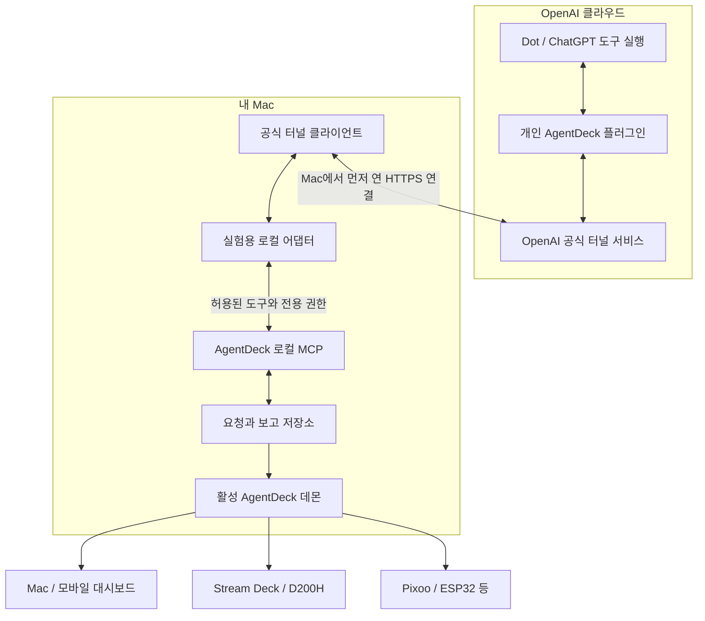
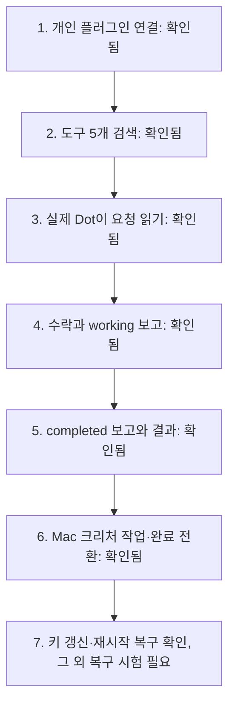
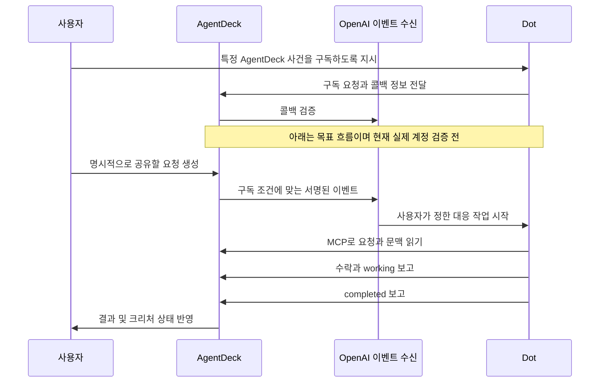
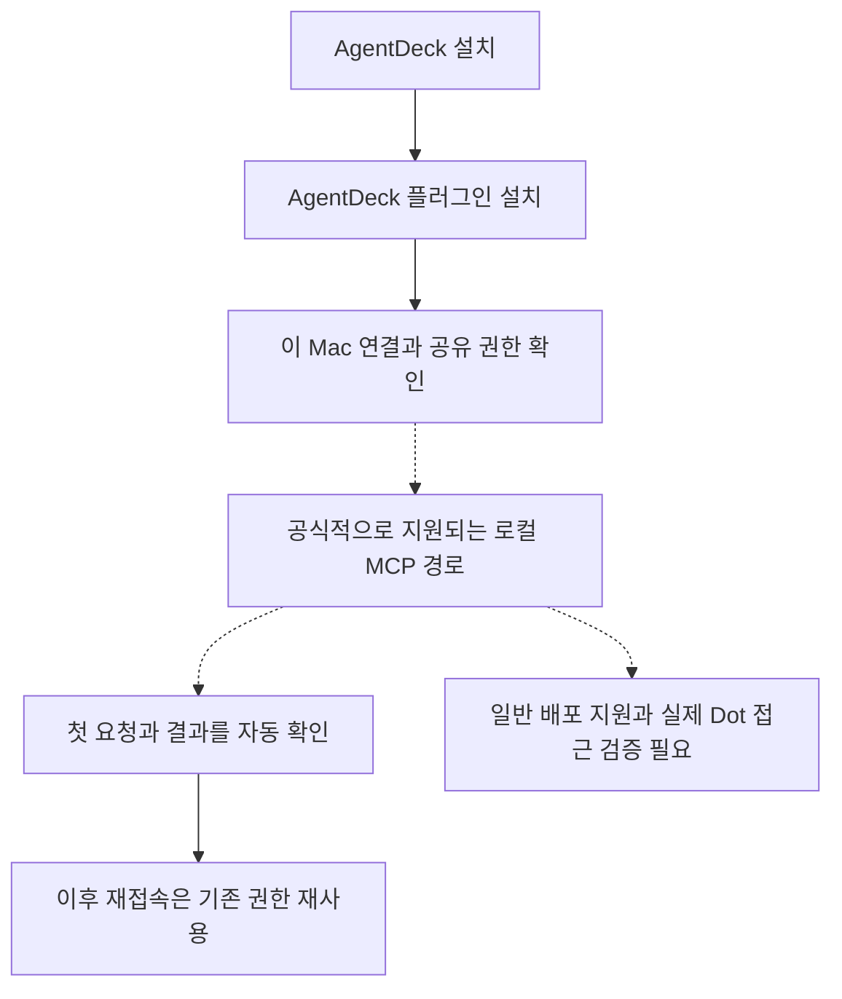

# Dot과 AgentDeck 연결: 지금 하는 일과 다른 사람에게 배포하는 길

기준일: **2026-10-11**. 제품을 이해하기 위한 설명 자료이며, 출시 안내나 설치 완료 선언이 아니다. 연결 상태는 이 날짜에 확인한 기록이다. 기술 결정은 [연결·배포 결정문](dot-distribution-decision.md), 표현 규칙은 [Dot 표면별 디자인](dot-creature-surfaces.md)이 기준이다.

## 먼저 알아둘 세 문장

**우리는 Dot이 AgentDeck에 공유된 요청을 읽고, 그 요청의 진행 상황을 돌려주게 만들고 있다.** AgentDeck은 받은 보고를 Mac 대시보드와 책상 위 디바이스의 크리처·상태 표시로 바꾼다.

**현재는 내 Mac에서 공식 터널을 사용하는 개인 연결 실험이다.** ChatGPT에 개인 플러그인을 연결했고, 실제 Dot이 공유 문맥을 읽어 요청을 수락하고 `working → completed`로 보고하는 데 성공했다. 터널 키 갱신 후 재시험에서 Mac의 작업 중 크리처 등장·위치 변화와 완료 상태 전환까지 확인했다. 다른 물리 디바이스의 실제 화면 검증은 별도로 남아 있다.

**누구나 설치해서 쓰는 제품은 다음 단계다.** 우리가 원하는 것은 사용자가 서버나 API 키를 관리하지 않아도 되는 로컬 연결이다. 이를 일반 사용자에게 배포할 수 있는 공식 경로는 별도로 확인해야 한다.

## 1. 각각 무엇을 맡는가

| 구성 요소 | 쉬운 설명 | 이번 작업에서 맡는 역할 |
|---|---|---|
| Dot | 클라우드에서 일하는 에이전트 | 공유된 요청을 읽고 처리한 내용을 보고한다 |
| AgentDeck | 내 Mac의 작업 현황판과 제어 시스템 | 요청·권한·보고를 관리하고 디바이스에 전달한다 |
| MCP | 에이전트와 앱 사이의 도구 사용 규약 | 요청 읽기, 작업 수락, 상태 보고의 형식을 정한다 |
| ChatGPT 플러그인 | ChatGPT가 사용할 도구를 찾고 연결하는 설치 단위 | AgentDeck 도구를 해당 계정에서 사용할 수 있게 등록한다 |
| 공식 터널 | 클라우드와 내 Mac 사이의 비공개 통신 통로 | Mac이 먼저 OpenAI에 연결해서 MCP 호출을 전달받는다 |
| 로컬 어댑터 | 두 연결 방식 사이의 변환기 | 공식 터널의 호출을 AgentDeck의 인증된 로컬 MCP 호출로 바꾼다 |
| MCP Events | 구독한 사건을 알리는 알림 규약 | 향후 AgentDeck의 사건으로 Dot 작업을 시작하는 데 사용한다 |
| 크리처 | 보고를 눈에 보이게 표현하는 캐릭터 | 작업 중·도움 필요·완료와 상호작용 관계를 표면에 맞게 보여준다 |

Dot은 클라우드에 있으므로 내 Mac을 끄더라도 클라우드 작업은 계속할 수 있다. 자신의 컴퓨터를 Dot에 연결하는 기능과 플러그인 연결은 별개이며, 로컬 컴퓨터 기능에는 온라인 상태와 실행 중인 ChatGPT 앱이 필요하다. [OpenAI: Computers and apps](https://learn.chatgpt.com/docs/dots/computers-and-apps)

## 2. 지금 연결된 구조

아래는 **현재 개인 실험의 통신 경로**다. 양방향 화살표는 도구 호출과 응답을 뜻한다. 이 통로를 통해 실제 Dot의 요청 처리와 완료 보고를 확인했다.

**별도의 AgentDeck 공개 서버를 운영하지 않는다.** 내 공유기의 인터넷 수신 포트나 내 도메인·인증서를 준비하는 방식도 아니다. 대신 OpenAI가 운영하는 터널 서비스를 이용한다. 따라서 “공개 서버를 직접 운영하지 않는다”와 “인터넷을 전혀 사용하지 않는다”는 서로 다른 조건이다. 공유한 요청과 결과는 이 연결을 통해 OpenAI 측으로 오간다. 공식 문서도 이 기능을 비공개 MCP 연결용으로 설명한다. [OpenAI: Secure MCP Tunnel](https://developers.openai.com/api/docs/guides/secure-mcp-tunnels)

현재 어댑터는 Mac에서 따로 실행하는 실험 도구다. **App Store의 AgentDeck 앱 하나만으로 이 터널까지 실행되는 상태는 아니다.** 소스 디렉터리 이름에 `dot-relay`가 들어가더라도, 이번 구성에서 그 프로세스가 외부 호스팅 서버라는 뜻은 아니다.

## 3. 연결됨, 작업 중, 완료는 각각 다른 사실이다

전화번호를 등록하고 통화가 가능한 것과, 상대에게 일을 맡겨 결과를 받은 것은 다르다. 이번에는 다음 순서로 증거를 쌓는다.

| 확인 항목 | 현재 증거 | 아직 의미하지 않는 것 |
|---|---|---|
| 개인 플러그인 | ChatGPT 상세 화면의 **연결됨** | Dot이 이미 일을 처리했다는 의미 |
| 클라우드 도구 검색 | 공식 터널의 `discovered`, 도구 5개 확인 | 상태 보고나 Events 구독 성공 |
| 실제 Dot 요청 처리 | 같은 요청의 수락, 순서 1의 작업 보고, 순서 2의 완료 보고와 정답 81·112 | 모든 작업의 성공, 크리처 반응 또는 Events 자동 실행 |
| 로컬 인증 | 별도 읽기·보고 권한, 실제 만료 후 갱신 검증 | 모든 사용자·모든 클라이언트에서의 로그인 호환성 |
| 구현 자동 검증 | 기존 전체 자동 검증 22단계 통과 기록 | 모든 실기기의 실제 Dot 연동 합격 |
| Mac 실화면 | 실제 보고에 따른 크리처 등장·작업 중 위치 변화·완료색과 문구 전환 | 모든 물리 디바이스 합격 또는 Swift 데몬 단독 시험 |
| 자동 알림 | 설계와 기존 실험 코드가 있음 | 현재 터널 어댑터에서 MCP Events 사용 가능 |

2026-10-10 23:23 KST에 기존 Dot 대화에서 직접 플러그인을 사용한 첫 왕복을 확인했다. 공유 문맥의 검증 표식과 숫자 17·23·41이 보고에 포함됐으며, 합계와 독립 검산은 모두 81이었다. 작업 보고부터 완료 보고까지 약 18초였고 데몬의 WebSocket 상태도 함께 바뀌었다. 잠금 해제 후 Mac의 완료 표시는 확인했지만, 작업 중 동작은 확인하지 못했다. 새 요청은 터널의 401 `token_invalidated`로 첫 조회부터 실패했다. 로컬 프로세스의 준비 상태가 정상이어도 클라우드 인증이 유효하다는 뜻은 아니다. 터널을 중지한 뒤 사용자가 키를 갱신했다. 2026-10-11 00:35 KST 재시험에서는 클라우드 인증과 도구 호출이 복구됐고, 새 문맥의 합계 112와 독립 검산을 보고했다. Mac의 작업 상태와 완료 상태를 실제 화면 및 시간차 캡처로 확인했다. Pixoo 미리보기 수정의 설치와 다른 실기기 화면 확인은 아직 남았다.

도구 5개는 `get_request`(요청 읽기), `get_context`(공유 문맥 읽기), `claim_request`(수락), `report_update`(진행·결과 보고), `report_interaction`(다른 에이전트와의 상호작용 보고)다.

## 4. 크리처는 무엇을 보여주는가

AgentDeck은 **AgentDeck 요청에 관해 받은 최신 보고**를 보여준다. ChatGPT 창이 떠 있다는 이유만으로 Dot을 작업 중으로 만들거나, 모든 클라우드 작업을 실시간으로 알고 있다고 표시하지 않는다.

| 실제로 아는 사실 | 화면의 의미 |
|---|---|
| 아직 연결되지 않음 | 설정·연결 위치에서 안내한다. 테라리움에 가짜 활동을 만들지 않는다 |
| 연결됐지만 보고가 없음 | 활동 보고를 기다리는 상태다. 연결 실패나 Dot 전체의 유휴 상태로 단정하지 않는다 |
| 신선한 `working` 보고 | 해당 요청의 작업 동작을 표현한다 |
| `completed` 보고 | 작업 동작을 끝내고 제한된 완료 반응 후 안정된다 |
| 보고가 오래되거나 연결이 끊김 | 현재 활동을 알 수 없다고 취급하고 작업 동작을 멈춘다 |
| 다른 에이전트에 위임했다고 보고 | 방향·대상·단계를 표시한다. 상대 에이전트의 독립적인 확인과 구분한다 |

큰 대시보드는 크리처와 설명을 함께, Stream Deck·D200H는 고정 키의 짧은 상태를, Pixoo·ESP32 같은 작은 표면은 간결한 도형과 동작을 쓴다. 모든 표면이 같은 보고의 의미를 공유하되 그림을 똑같이 축소해서 쓰지는 않는다. 구체적인 구현 범위와 아직 계획인 표면은 [표면별 디자인 문서](dot-creature-surfaces.md)를 따른다.

사용자가 고른 Dot 그림은 현재 수동 이미지 가져오기로 대체할 수 있다. ChatGPT의 캐릭터를 자동으로 가져오는 공개 인터페이스는 이번 조사에서 확인하지 못했다. 가져온 평면 이미지가 자동으로 3D 모델이 되는 것도 아니다.

## 5. MCP Events가 더해지면 무엇이 달라지는가

지금 검증하는 것은 **사람이 Dot에게 지시했을 때 AgentDeck 도구를 쓸 수 있는가**다. Events의 목표는 **AgentDeck에서 생긴 사건이, 사용자가 미리 정한 구독과 지시에 따라 Dot의 작업을 시작하게 하는 것**이다.

Events는 **AgentDeck → Dot 방향의 사건 알림**이다. OpenAI가 Dot의 모든 내부 상태를 AgentDeck으로 방송하는 피드는 아니다. 작업 결과는 다시 MCP 보고 도구를 통해 받아야 한다. 공식 문서는 MCP 2.0, 이벤트 검색·구독·해지, HTTPS 콜백 검증과 서명 전달을 요구한다. [OpenAI: MCP Events](https://developers.openai.com/plugins/build/mcp-events)

현재 연결은 MCP `2025-11-25`로 도구 5개만 확인했다. 현재 어댑터에는 Events 메서드와 구독 권한이 없다. 따라서 다음 개발은 단순한 화면 버튼 추가가 아니라 **프로토콜 지원, 구독 권한, 만료·재구독, 중복 전달 처리, 실제 자동 호출 검증**까지 포함한다. 이전 Events 코드의 존재만으로 이 연결에서 동작한다고 할 수 없다.

## 6. 앱을 닫거나 Mac을 끄면

“로컬 컴퓨터 연결”과 “현재 공식 터널 실험”은 별개의 통신 경로다. 아래에서 조건부라고 표시한 내용은 구조상 예상이며 실제 종료·복구 시험이 남아 있다.

| 상황 | Dot의 클라우드 작업 | AgentDeck 연결에서의 판단 |
|---|---|---|
| ChatGPT 창만 닫음 | 창 유무만으로 중단을 판단할 수 없음 | 앱 프로세스·연결·보고를 각각 확인 |
| ChatGPT 앱 완전 종료 | 클라우드 Dot은 계속 존재 | 공식 로컬 컴퓨터 경로는 사용 불가. 별도 터널은 AgentDeck·클라이언트가 살아 있으면 통신 가능할 것으로 예상하나 실제 Dot 시험 필요 |
| AgentDeck 종료 | 클라우드 작업은 별개 | 내 Mac의 요청·보고 도구 사용 불가 |
| Mac 잠자기 또는 전원 끄기 | 클라우드 작업은 계속 가능 | 이 Mac의 도구는 접근 불가로 취급. 복귀 뒤 새 증거로 상태 갱신 |
| 터널 키 만료 또는 네트워크 단절 | 클라우드 작업은 별개 | 통신 실패. 마지막 working을 계속 움직이게 하면 안 됨 |
| 플러그인 연결 해제·AgentDeck 권한 철회 | Dot 자체의 종료는 아님 | 해당 연결의 도구 접근을 차단 |

클라우드 지속성과 로컬 컴퓨터 요구 조건은 [공식 설명](https://learn.chatgpt.com/docs/dots/computers-and-apps)에 근거한다. 터널 종료 시 동작은 우리 구성의 별도 검증 항목이다.

## 7. 다른 사람도 쓰게 하려면

### A. 소수 시험 사용자에게 지금 방식을 재현하기

같은 개인 실험을 다른 사람의 Mac에 구성하는 경로다. 아직 검증된 일반 설치 프로그램은 아니다.

사용자별로 AgentDeck, 실험용 어댑터와 실행 환경, 공식 터널 클라이언트, 해당 계정에서 이용 가능한 Dot·플러그인·터널 권한이 필요하다. 각자 자신의 터널과 제한된 런타임 키를 만들고, 개인 ChatGPT 연결과 로컬 AgentDeck 권한을 승인해야 한다. 키 갱신·프로세스 시작·Mac 재시작 후 복구도 관리해야 한다. 현재 어댑터의 자격 증명 보관은 macOS/Linux 기준이며 Windows 지원은 미완료다.

개발자의 터널 ID·키·AgentDeck 권한을 여러 사용자에게 나눠주면 안 된다. 현재 연결은 한 명의 운영자와 하나의 로컬 권한을 전제로 하며 공유 워크스페이스의 사용자별 구분을 해결하지 않는다. 복제할 것은 코드와 절차이고, 권한과 자격 증명은 설치별로 새로 만들어야 한다.

### B. 일반 사용자가 쉽게 설치하는 제품 만들기

우리가 선택한 목표는 다음 흐름이다. **점선은 지원 여부를 확인해야 하는 부분**이다.

이 경로가 성립하려면 OpenAI의 로컬 MCP 설치·인증·Dot 접근 지원을 확인해야 한다. 공개 배포 문서는 MCP 서버에 공개 HTTPS 주소를 요구하고, 로컬로만 실행해야 한다면 OpenAI에 로컬 MCP 지원을 문의하도록 안내한다. 공식 터널 단독으로는 공개 배포 경로가 되지 않는다. [플러그인 패키징](https://developers.openai.com/plugins/build/plugins#bundled-mcp-servers-and-lifecycle-hooks), [공식 터널 범위](https://developers.openai.com/api/docs/guides/secure-mcp-tunnels)

따라서 현재의 결정은 **개인 실험으로 실제 왕복을 먼저 증명하고, 공식 로컬 배포 경로가 확인될 때 일반 설치 경험으로 발전시킨다**는 것이다. 지원이 확인되지 않으면 선택형 비공개 프리뷰로 유지한다.

### C. 공개 서버를 운영하는 대안

안정적인 공개 HTTPS MCP 서비스와 사용자별 인증을 운영하는 별도 설계도 검토할 수 있다. 이 경우 계정과 기기 연결, 사용자 간 데이터 격리, 로컬 Mac으로의 통신, 서비스 운영비, 장애 대응, 개인정보 정책과 공개 플러그인 심사가 추가된다. 공개 주소만 만들면 이 문제가 모두 해결되는 것은 아니다.

**이 대안은 현재 선택하지 않았다.** 사용자가 정한 “AgentDeck 공개 서버를 운영하지 않는다”는 조건을 바꾸는 제품 결정이 필요하다. 로컬 배포 지원이 불확실하다고 해서 자동으로 이 대안으로 바꾸지 않는다.

| 비교 | 현재 개인 실험 | 소수 사용자 프리뷰 | 목표 일반 배포 |
|---|---|---|---|
| 대상 | 지금의 내 Mac | 직접 설정 가능한 시험 사용자 | 일반 AgentDeck 사용자 |
| 통신 | 공식 터널 + 별도 어댑터 | 설치별 공식 터널 | 지원이 확인된 로컬 연결을 우선 |
| Platform 키 관리 | 운영자가 직접 | 사용자마다 직접 | 사용자에게 요구하지 않는 것이 목표 |
| 별도 AgentDeck 공개 서버 | 없음 | 없음 | 현재 방침상 없음 |
| App Store 앱만으로 완결 | 아님 | 아님 | 자체 완결 동작과 배포 지원 검증 필요 |
| 현재 상태 | 연결·도구 검색 확인 | 재현 시험 전 | 공식 지원·설치 경험 확인 전 |

## 8. 로그인 버튼이나 플러그인 하나로 해결되지 않는 이유

연결에는 네 가지 질문이 있다.

| 질문 | 해결하는 장치 |
|---|---|
| 이 사용자는 누구인가? | 계정 로그인 |
| 어떤 AgentDeck 도구를 사용할 수 있는가? | 플러그인 등록과 도구 검색 |
| 클라우드가 이 Mac에 어떻게 도달하는가? | 지원되는 로컬 경로 또는 터널 |
| 어떤 정보를 읽거나 보고해도 되는가? | AgentDeck의 범위가 제한된 권한 |

Sign in with ChatGPT의 신원 로그인은 계정 신원 확인에 해당한다. 이를 추가하는 것만으로 기존 Dot의 호출 경로나 AgentDeck 도구 접근 권한이 만들어지지는 않는다는 것이 우리 설계 판단이다. [OpenAI: 신원 로그인](https://developers.openai.com/siwc/website)

플러그인은 설치 경험을 단순하게 만들 수 있다. 다만 플러그인 안에 연결 정보를 넣는 것과 그 연결을 Dot이 실제로 사용할 수 있다는 것은 별도로 시험해야 한다. 앞선 로컬 시험에서는 이 Codex 대화에 도구가 있어도 Dot이 만든 다른 작업에는 도구가 없었다. 그래서 현재 공식 터널 경로를 별도로 검증하고 있다.

## 9. 배포까지 남은 작업과 완료 기준

| 순서 | 해야 할 일 | 완료로 판단할 증거 |
|---|---|---|
| 1 | 실제 Dot의 도구 사용 | 같은 요청 ID의 읽기·수락·진행·완료와 올바른 결과 |
| 2 | 상태 표시와 복구 | Mac 및 대표 덱에서 실제 보고 반영, 완료·끊김 뒤 작업 동작 정지 |
| 3 | 계정·권한 경계 | 다른 권한으로 요청 읽기 거부, 철회 즉시 차단, 만료·재연결 검증 |
| 4 | 선택 기능인 Events | 실제 구독·콜백 검증·자동 실행·해지와 중복·만료 처리 |
| 5 | 다른 사람의 설치 | 새 계정·새 Mac에서 개발자 자격 증명 없이 정해진 절차 재현 |
| 6 | 일반 로컬 배포 지원 | OpenAI의 지원 범위, 계정·환경 조건, 설치·인증·업데이트 경로 확인 |
| 7 | App Store와 각 배포 채널 | Swift 단독 동작, 서명된 샌드박스 Release, 심사 자료와 실제 표면 검증 |

현재 구현은 Node와 Swift의 요청·보고 모델을 공유하는 방향이지만, **Node로 실행하는 실험 어댑터를 검증했다고 Swift 앱 자체의 터널 기능까지 검증한 것은 아니다.** App Store 앱에는 외부 터널 실행 파일이나 셸 실행을 넣지 않는 것이 프로젝트의 배포 원칙이다. 향후 네이티브 연결이 필요하면 공식 지원 프로토콜·SDK와 권한 발급 방식을 먼저 확인해야 한다. [App Store 기능 범위](appstore-feature-matrix.md), [배포 결정](dot-distribution-decision.md)

소수 사용자 시험과 일반 공개 배포의 완료 기준은 분리한다. 다른 사용자에게 안내할 수 있는 시점에도 검증된 기능, 필요한 수동 설정, 지원하는 환경을 정확히 적는다. Events가 준비되지 않았다면 수동 지시 기반 연동만 설명한다.

## 10. 설명과 구현을 함께 유지하는 법

이 문서는 계정 ID, 터널 ID, 키, 요청 내용과 개인 화면 캡처를 포함하지 않는 공유용 설명이다. 크리처 시각 검증과 복구 시험이 통과하면 3절의 증거와 9절의 완료 기준을 갱신한다. 공식 지원 조건이 바뀌면 출처를 다시 확인하고 7절의 배포 경로를 수정한다.

- [기술 결정과 날짜별 검증 기록](dot-distribution-decision.md)
- [공식 터널 어댑터 실험 절차](../integrations/openai-tunnel/README.md)
- [로컬 플러그인 시험 패키지](../integrations/chatgpt-local/README.md)
- [Dot 크리처·상호작용·표면별 표현](dot-creature-surfaces.md)
- [이전 MCP Events 계획과 구현 기록](dot-mcp-events-plan.md)
