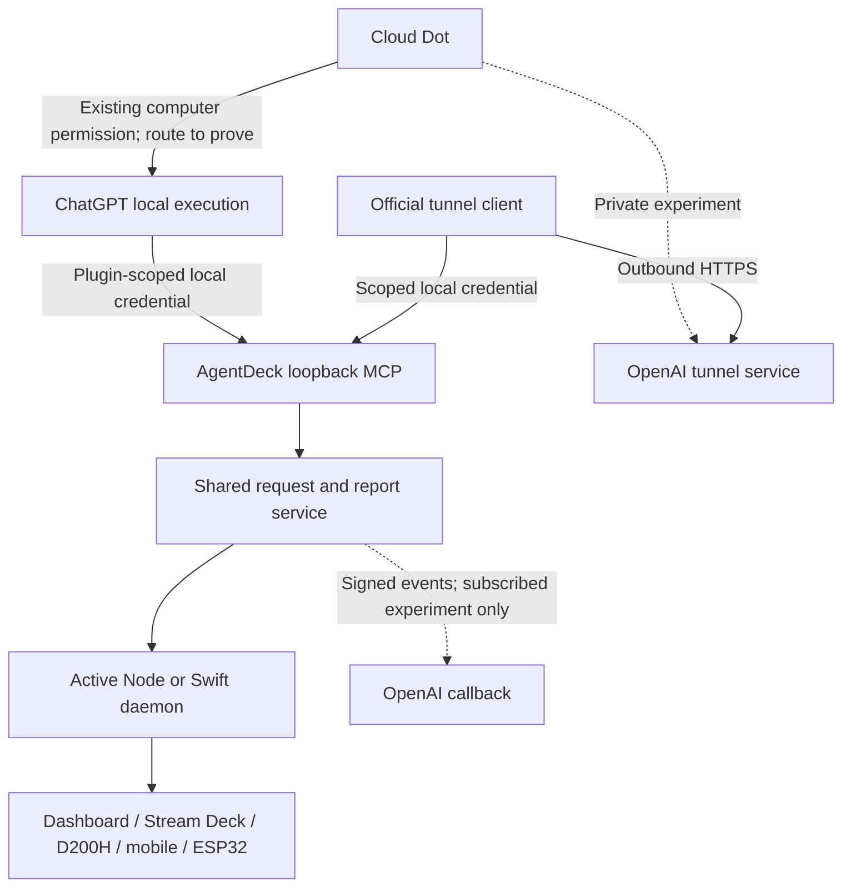

# Dot connection and distribution decision

Reader overview: [Dot 연결과 배포를 쉽게 설명한 한국어 안내](dot-connection-explained.ko.md), with diagrams of the current private experiment, request lifecycle and public-distribution gates.

Decision date: 2026-10-09. This is the current product and transport plan. It supersedes the public-domain/certificate onboarding in [the earlier MCP Events plan](dot-mcp-events-plan.md), while retaining its request/report contracts and [surface semantics](dot-creature-surfaces.md). Research is complete for this decision; real Dot interoperability and public distribution are not established.

## Decision

Build toward **AgentDeck + a local ChatGPT plugin + the user's existing Dot computer connection**. Keep AgentDeck on the user's Mac, require explicit local pairing, and reuse ChatGPT's existing account and computer permission. Do not require a second AgentDeck account or Sign in with ChatGPT merely to connect Dot.

This is the selected product direction, not a claim that OpenAI currently offers self-service public distribution of that complete integration. Prove the local route in a private plugin first. Obtaining a supported public local-MCP distribution path is a separate launch gate. If that gate cannot be met, keep Dot integration an opt-in private preview; do not advertise a one-click public integration or substitute a hosted service silently.

Use the official Secure MCP Tunnel only for the private MCP Events experiment and optional operator-managed use. Do not make a tunnel ID, Platform organization, API key, domain or certificate part of ordinary AgentDeck onboarding. No AgentDeck-operated public server is authorized by this decision.

Three requested properties are not jointly established by the current public documentation: (1) no public service operated by AgentDeck or users, (2) install-and-consent onboarding for arbitrary users, and (3) cloud Dot event activation and return calls. Login and plugin packaging alone do not establish the third property's local transport. The release gate must remain visible rather than being hidden by more implementation.

## What the official contracts establish

| Topic | Confirmed evidence | Consequence for AgentDeck |
|---|---|---|
| Dot computer access | Dot can use a connected personal computer, local tasks and supported plugins. One personal computer can be connected; it must be online with ChatGPT open. Local skills require a connected computer. [Computers and apps](https://learn.chatgpt.com/docs/dots/computers-and-apps) | Existing computer access is the first route to test. It does not prove that an arbitrary local MCP server is exposed directly to Dot. |
| Desktop-only plugins | Such plugins exist, but installation/use depends on the desktop app and supported surfaces. [Plugins](https://learn.chatgpt.com/docs/plugins) | A first-party desktop plugin is evidence of a product capability, not proof that third parties can register the same native extension. |
| Public MCP distribution | Public submission requires a public HTTPS MCP endpoint. Developers unable to host local MCP publicly are directed to contact OpenAI about local MCP support. [Packaging](https://developers.openai.com/plugins/build/plugins#bundled-mcp-servers-and-lifecycle-hooks) | Do not promise public directory acceptance of a loopback URL, local executable or tunnel-backed server. |
| Skills-only distribution | Skills-only packages have a submission path, but MCP configuration is excluded; credentials or persistent user settings require MCP in the documented migration guidance. [Skills-only submission](https://developers.openai.com/plugins/guides/submit-claude-plugin#submit-a-skills-only-plugin) | A setup/help skill can be published separately. Do not disguise an authenticated local service as a skills-only connection workaround. |
| Commercial ChatGPT sign-in | Identity sign-in uses registered OAuth/OIDC clients; commercial access is a limited partner trial. Connector authorization and user sign-in are separate transactions. [Website sign-in](https://developers.openai.com/siwc/website), [plugin sign-in](https://developers.openai.com/siwc/chatgpt-plugin) | Useful if an AgentDeck account service is later needed, but it neither creates a local route nor grants tool permissions by itself. |
| Open-source ChatGPT plan usage | A local open-source client can dynamically register without a partner API key/client secret and obtain permission for eligible model requests. It does not obtain ChatGPT conversations/account context. [Overview](https://developers.openai.com/siwc/token-sharing-open-source), [registration](https://developers.openai.com/siwc/token-sharing-open-source/sign-in) | This could power a separate AgentDeck AI feature. It does not connect to the user's existing Dot. Eligibility for a paid or remotely hosted product must not be inferred from the OSS flow. |
| Plan-usage limitations | The current direct inference route excludes hosted MCP/connectors and several other hosted tools. [Preview limitations](https://developers.openai.com/siwc/token-sharing-open-source/preview-limitations) | Do not repurpose a plan-usage token as a tunnel-management token or a Dot-control API credential. |
| MCP Events | ChatGPT subscribes to events produced by our server and supplies a signed HTTPS callback contract. The integration supports Work Cloud and dots. [MCP Events](https://developers.openai.com/plugins/build/mcp-events) | Events can wake an authorized workflow; they are not an OpenAI feed of every Dot state change. Tool calls to AgentDeck still require a reachable authenticated MCP path. |
| Cloud Dot hooks and telemetry | Local/plugin command hooks do not run with cloud orchestration. Enterprise remote MCP hooks and cloud audit records have separate scopes; local OTel does not contain all cloud orchestration. [Cloud/local compatibility](https://learn.chatgpt.com/docs/enterprise/cloud-local-access#check-hooks-and-network-compatibility) | No personal-account lifecycle-hook workaround or claim that a local transcript/OTel collector observes all Dot activity. |
| Official tunnel | An outbound client forwards MCP calls to a private server. It needs a tunnel identity, runtime key and permissions/workspace association; it is not a public plugin distribution route. [Secure MCP Tunnel](https://developers.openai.com/api/docs/guides/secure-mcp-tunnels) | Suitable for private interoperability testing. Each installation/organization owns its credentials; a publisher's key is never shipped. |

No documented public API for a personal Dot's global live state, avatar synchronization, or arbitrary remote pause/approval was established in this review. This is a bounded research result, not a claim that no internal or future interface exists. Retain manual character import and the distinction between a reported interaction and target-side acknowledgement.

## Target user experience and capability boundary

The intended public flow, conditional on local-MCP distribution support, is:

1. Install/open AgentDeck and install the AgentDeck plugin in ChatGPT.
2. Grant the existing Dot's access to this Mac in ChatGPT, if not already granted.
3. Approve a local AgentDeck pairing with visible scopes: selected context reads and request/report writes. Subsequent reconnects reuse a revocable grant.
4. Ask Dot to use AgentDeck. Show a successful correlated round trip before declaring the connection ready.

Account login, Dot computer permission, plugin installation and local pairing are separate grants. Reduce repeated setup by persisting valid grants, not by bypassing them. Installation does not silently share transcripts, authorize agent commands, or enroll an event subscription. User-configured subscriptions need their own supported enrollment flow.

| Capability | Local-plugin preview | Private Events experiment | Public launch claim |
|---|---|---|---|
| Explicit Dot request reads selected AgentDeck context and returns a report | Candidate; must pass a real Dot/local-executor test | Candidate through tunneled MCP | Only after the relevant real-account and distribution gates |
| Physical key automatically wakes a cloud Dot | Not established by local plugin installation | Candidate through MCP Events | Requires an officially supported subscription and MCP return path |
| Show all unrelated cloud Dot work | Not available from the proposed contracts | Not supplied by MCP Events | Do not claim |
| Show reported delegation/control relations | Reuse bounded report store | Same report store | Label report provenance; verified target observations remain distinct |
| Work after ChatGPT quits | Local computer route becomes unavailable | May work if AgentDeck, tunnel and subscription remain usable; must test | Never infer cloud Dot stopped from local disconnect |
| Work after Mac sleeps or AgentDeck stops | Local tools unavailable | Local tools unavailable | Keep historical reports; no always-online device promise |

The public skills-only fallback is setup/documentation and user-invoked workflows supported by existing tools. It cannot be marketed as the authenticated live connection or event transport. Do not initially publish a skills-only listing under the assumption that MCP can simply be attached later: the [current submission flow](https://developers.openai.com/plugins/deploy/submission) does not support adding an MCP server to an existing skills-only plugin. Keep any such companion's identity and purpose explicit.

## Architecture

The diagram is a proposed routing design. The first edge must be tested with Dot itself; a Codex local-tool success does not prove it. If Dot delegates the call to a local task, record that execution context and label the result accordingly instead of claiming a direct Dot MCP invocation.

Keep one domain service for request creation, claims, context, reports, relationships, expiry, revocation and rendering. Transports adapt to it; neither a plugin nor a tunnel owns the source of truth. Reuse the existing schemas and per-surface freshness rules. Do not add a fake session, inflate workload counts, or resurrect a stale WORKING animation during reconnection.

The proposed local adapter binds loopback only and uses an explicit, revocable, plugin-scoped grant. It exposes a route allow-list and bounded payloads, rejects invalid Host/Origin and unsolicited browser access as appropriate, and rate-limits pairing. Loopback location is not authentication. Pair through a user-confirmed one-time transaction; keep credentials outside model prompts/results and plugin archives. Never reuse the hub's LAN pairing token or OpenAI session cookies. Multi-user/workspace identity must be bound by the transport; a model-written actor label cannot establish identity.

The official-client experiment has a separate local credential and restricted personal/workspace context. A fixed header supplied by one operator cannot identify separate users in a shared tunnel. OAuth discovery passing through the tunnel does not make the authorization server automatically reachable; test its browser and token paths independently. Do not promote the private experiment's authentication arrangement to multi-user/public distribution.

Swift implements the local adapter in-process using native networking and Keychain, under the existing daemon ownership/isolation rules. Node exposes the same domain contract. No shell, embedded interpreter, official tunnel binary or external-helper installation prompt is added to the App Store app. These are [repository product constraints](../.claude/rules/apple-release.md), not a prediction of App Review acceptance. A signed sandboxed Release test remains required.

A future in-process Swift tunnel client would require a documented supported protocol/SDK, authorized credential provisioning and native compatibility validation. Porting observed traffic from the official binary is not a selected solution. A future AgentDeck-operated relay would change the no-public-service decision and introduce account, availability, privacy and operating-cost responsibilities; it is outside this plan.

## Implementation and validation order

| Stage | Concrete deliverable | Exit or fallback |
|---|---|---|
| 0. Correct the product contract | This decision, legacy-plan supersession, App Store planned rows, honest setup/display wording | No requirement for public DNS/certificates in the selected product plan; existing implementation remains clearly marked experimental |
| 1. Finish local transport parity | Node and Swift loopback adapter over the existing store; explicit pairing/revocation; plugin capability discovery; separate local/Events capability flags | Positive/negative auth tests, expiry/restart/ownership tests and signed sandbox validation. Generated shared constants, no new per-platform magic values |
| 2. Prove local plugin execution | Private marketplace package with setup/use skills and authenticated MCP configuration; fresh user profile and real Dot tests | Demonstrate which executor invokes which tool, without manual token/file editing. If only local Codex works, label only local Codex support |
| 3. Prove Dot workflows | Ten correlated context/claim/report round trips, including a delegated local task, idle resume, disconnect, stale report, revoked grant and account/workspace mismatch | Record call provenance, required approvals, failures and timings. No completion inferred from receipt or silence |
| 4. Prove optional Events | Official private tunnel, discovery, event list, subscribe/verify, delivery, report, refresh and unsubscribe using a real Dot | Button-to-result test plus duplicate/out-of-order/expiry/offline tests. A mocked callback or HTTP 2xx does not pass |
| 5. Resolve public distribution | OpenAI confirmation of third-party local-MCP packaging, Dot/local support, authentication and supported install/update path; clean-profile install test | If unavailable, remain a private preview. Do not replace it with a public relay or hide manual tunnel credentials behind misleading copy |
| 6. Release the demonstrated scope | Full repository verification, Release archive gate, Node/Swift parity, physical surface acceptance and review/privacy text | Publish only capabilities whose transport, account, lifecycle and installation gates passed |

The real-account lifecycle matrix must cover ChatGPT foreground/background/window-close/full-quit, AgentDeck stopped/restarted, Mac sleep/wake, computer permission revoked, plugin disabled/uninstalled and the selected connection revoked. Keep each signal separate. A local task already running may behave differently from a newly requested task; test both. Do not quit the only client controlling the test.

Physical acceptance uses one desktop and one deck before widening to all surfaces. Reuse the existing Dot artwork, fixed deck position and custom image path. Render stale/unavailable reports quietly; state and relationships must remain readable without motion. Verify working-to-completed and working-to-stale on Swift as well as Node before another broad installation.

## Questions to resolve with OpenAI

These are prepared questions, not a sent message or an assumed partnership:

- Can third-party publishers distribute a desktop-only loopback/stdio MCP plugin publicly, and what enrollment, review and signing requirements apply?
- Can a Dot call that plugin through its connected Mac, or only delegate to a local Work/Codex task? Which account plans, operating systems and workspaces support it?
- Does that local transport support MCP 2.0 Events discovery, subscription creation/refresh and later cloud calls, including while no local task is open?
- Is there a supported native SDK or delegated credential flow that lets an App Store app use Secure MCP Tunnel without a separate executable or a user-managed Platform API key?
- Is there a public personal-Dot identity/activity/appearance contract? Which identifiers prove provenance and survive reconnects?

Do not wait indefinitely for an answer: stages 1–3 can validate private local usability; stage 4 validates the already-authorized operator experiment independently. Stage 5 blocks a public zero-configuration claim, not the rest of AgentDeck's release.

## Evidence at this decision

Official sources above were retrieved on 2026-10-09. Repository review confirmed an existing native HTTPS/OAuth host, bounded report contracts and portable rendering, plus unfinished private-transport work in the earlier integration checkout. It did not establish a usable local plugin, a configured live Dot subscription, a public distribution entitlement, or a finished native loopback adapter.

This research change modifies documentation only. It creates no tunnel, account, credential, subscription, public listener or production report. Existing source/deployment receipts remain evidence for their own tested scope; they do not establish the new transport or onboarding. Record future interoperability evidence separately with build identity, account surface, executor, transport, scenario and observed result.

## Implementation checkpoint — 2026-10-09

The Node and native Swift hosts now have an explicit IPv4-loopback mode, public-client
OAuth with PKCE and local consent, and local requests that do not require an Events
subscription. Local requests retain `delivery: local`; preparing one does not wake Dot.
The macOS UI offers local setup first and exposes request IDs. Node `dot init-local`
creates configuration exclusively without replacing existing settings.

The private [plugin package](../integrations/chatgpt-local/README.md) is a test artifact.
A newly confirmed distribution gate changes the automatic-onboarding assumption:
[the portable MCP schema](https://agent-plugins.org/schemas/1.0.0/mcp.schema.json)
allows transport, URL and headers, but no pre-registered OAuth client fields.
An explicit local client configuration is included for protocol experiments. Installing
this portable plugin alone is not yet a verified authentication flow. Resolve this through
confirmed host support or a separately reviewed bounded dynamic-registration implementation
in both hosts before promising one-click setup. Do not embed tokens or unsupported fields.

Real Dot invocation, delegated execution, account consent, Mac sleep/restart and public
plugin distribution still require client/account evidence. Unit tests cannot attest them.

## Real account validation

Test date: 2026-10-09.

The first live attempts did **not** pass the Dot interoperability gate:

| Execution context | Observed result |
|---|---|
| Existing local Codex host | OAuth completed and the five AgentDeck tools were exposed. This proves local-client authentication/discovery only. |
| Direct Dot conversation | Dot reported that AgentDeck MCP tools were unavailable and did not process the request. The operator store retained null claim and report fields. |
| Dot-created task on the connected Mac | Dot created a separate task. Its task record identified host `durable`, distinct from the testing chat's `local` host. The child reported unavailable AgentDeck MCP tools before `get_request`; its recorded turn contains no AgentDeck call, and the operator store still had no claim or report. |

Computer access and task creation therefore succeeded, but the tested delegation did
not expose the locally configured MCP tools. A local working directory is not proof
of local-only coordination or inherited MCP configuration. Official documentation
distinguishes [cloud coordination with local execution](https://learn.chatgpt.com/docs/enterprise/cloud-local-access)
from local-only tasks and scopes shared [MCP configuration](https://learn.chatgpt.com/docs/extend/mcp)
to a Codex host. The precise client-side reason for the missing tools remains
unconfirmed; the observed failure does not establish that every Dot/local path is
unsupported.

Do not retry by merely changing the prompt, reapproving the same local grant, or
creating more expiring requests. First establish a supported way to expose the
authenticated tools to the actual Dot-created executor. A client capability or
configuration change needs a fresh correlated test. The already-authorized private
Secure MCP Tunnel experiment remains a separate alternative, with its own account
setup and acceptance; it is not an automatic fallback or ordinary onboarding.
Do not manufacture a report through shell/HTTP calls, move credentials into the
cloud task, or label a manually created local Codex run as a Dot round trip.

The released rendering fixes remain valid: an approved local grant without a
report displays **Awaiting activity** in status chrome and no habitat creature.
The local transport is a private preview; **Dot interoperability remains blocked
at tool availability**, and no public Dot integration claim is justified yet.

## Official tunnel preflight

Test date: 2026-10-09. Immediately after the operator signed into Platform, the
Personal organization displayed **Tunnels access required**, and the linked roles
page refused `organization.read`. On returning to Tunnels after login settled,
the page instead showed **No tunnels yet** and an enabled Create tunnel button.
The creation form offered the personal organization and one associated ChatGPT
workspace. The initial permission errors were transient observations, not a
confirmed account blocker. Do not infer a required paid plan or a universal
personal-account exclusion from them. The operator then created the private
AgentDeck tunnel. Its saved name and organization/workspace associations were
verified in the edit form without changing them.

The official Darwin ARM64 `tunnel-client` release v0.0.16 was downloaded from the
OpenAI release repository and matched against its published SHA-256 asset digest.
The operator created a one-day runtime key restricted to Tunnels Read + Use and
saved it privately in a mode-0600 file. The profile stores only a file reference.
`doctor` passed and the official managed `runtimes connect` process started.
A subsequent `runtimes status` reported a running process, `ready`, and no remote
error. No public AgentDeck listener was added.

This proves tunnel runtime readiness, **not authenticated MCP or Dot acceptance**.
The local MCP initialization probe returned `401 Unauthorized`; the official
client explicitly allows readiness when MCP initialization requires auth. Its
OAuth discovery found AgentDeck metadata, but the automatically discovered
loopback HTTP OAuth targets were rejected by Harpoon's HTTPS policy. The
plaintext override remains disabled. Even resolving that transport issue alone
would not fix the OAuth client contract: AgentDeck's current local mode allows
its registered local client and loopback callbacks only. A harmless request with
an HTTPS callback was rejected with `400 invalid_request`, as designed.

AgentDeck access tokens expire after five minutes, so one static header is not a
maintained connection. On 2026-10-10 the private experiment added a
[stdio adapter](../integrations/openai-tunnel/README.md) between the official
client and authenticated loopback MCP. It holds a separately approved local
read/report grant, rotates tokens on demand, and forwards bounded tool requests
without opening another listener. An uncertain refresh outcome fails closed;
claims/reports are never automatically replayed. The existing Codex grant stays
separate. This helper is not shipped inside the App Store application.

This arrangement uses the official tunnel's workspace access boundary and a
single local principal. The custom MCP connector uses No Auth at its layer,
while AgentDeck still requires the adapter's local bearer token. It cannot
identify separate users sharing a tunnel and must remain a personal-operator
experiment. It implements tools only, not MCP Events. Authenticated local
initialize and five-tool discovery passed; those probes are not Dot activity.
The real local probe waited beyond the original five-minute token expiry, then
successfully rotated credentials and completed another MCP ping. The official
managed runtime was switched from HTTP to this stdio command; a fresh status
reported a running process, readiness and no remote error. Before plugin creation,
MCP health reported `not_observed`, initialize epoch zero: a running child and
`/readyz` alone do not prove cloud-side discovery.

After the user's action-time approval, the personal **AgentDeck Mac Studio**
plugin was created and connected in Chrome on 2026-10-10. ChatGPT's plugin detail
page displayed **Connected**. The official runtime recorded cloud-side discovery
at `2026-10-10T09:30:31.530993Z`: status `ok`, state `discovered`, stdio transport,
`same_child` evidence and initialize epoch 2. Both initialize and tools/list
succeeded with protocol `2025-11-25`; the complete five-tool list was
`get_request`, `get_context`, `claim_request`, `report_update` and
`report_interaction`. This passes personal plugin installation and cloud-side
discovery, but does not yet establish a Dot invocation, correlated report,
physical surface reaction or Events subscription.

The adapter's eight focused tests and the 22 automated pre-release checks passed,
including 5,625 JavaScript tests, daemon E2E, native builds/tests and the packaged
daemon acceptance run. The recorded pre-release receipt identifies a dirty
experimental checkout, not a published release. Windows native runtime and the
manual hardware/Swift live gates were not attested by that run. These results do
not establish a real Dot request or MCP Events subscription.

Resume using the [official setup guide](https://developers.openai.com/api/docs/guides/secure-mcp-tunnels):

1. Use the installed personal plugin for a fresh actual Dot test. Earlier test
   requests expired. Share the new request with the dedicated tunnel grant,
   rather than the separate local Codex grant. Verify correlated
   read/claim/working/completed calls and disconnect/reconnect behavior. Keep
   shared context limited to the test payload. A successful probe from this
   local Codex chat is not Dot proof.
2. Keep authentication lifecycle and tunnel readiness as separate checks. The
   approved local grant and its refresh have been exercised; the connector uses
   the tunnel's access boundary, not cloud-to-loopback browser OAuth. Do not reset
   existing local grants while testing revocation or adapting the contract.
3. For future UI work, the native ChatGPT/Codex app denial does not imply a
   browser-settings denial: the supported Chrome interface completed this
   connection after confirmation. New or broader access still needs action-time
   confirmation under the browser tool's policy; the same approved connection
   does not need repeated consent.

The runtime key is short-lived and requires operator renewal after expiry. No
admin key or production Events subscription exists in this experiment. A real Dot
request/report round trip subsequently passed, as recorded below. The main daemon and operator-control ports are not tunnel targets.

## First real Dot round trip — 2026-10-10 23:23 KST

The user authorized a test message in the existing Dot conversation. Chrome's
ChatGPT Dot page was used; this was not a locally delegated Codex task and this
verification agent did not call the reporting tools on Dot's behalf. The fresh
request was scoped to the dedicated tunnel grant. Its context held a test marker
and the numbers 17, 23 and 41.

| Observation | Time (KST) | Evidence |
|---|---|---|
| Request accepted | 23:23:25.583 | Operator store recorded a claim and attempt |
| Working report | 23:23:36.227 | Sequence 1 included the marker and three context numbers |
| Completed report | 23:23:54.080 | Sequence 2 included sum 81 and independent arithmetic verification |
| Daemon propagation | Same working/completed transitions | WebSocket `sessions_list.dot` carried codes 2 then 4 and matching report timestamps |

This establishes one real, manually initiated Dot request/report round trip.
The context-specific contents support successful context access; the operator
record does not individually audit each read-only tool call. The observed working
interval was about 18 seconds. It does not establish Events, ten-round reliability,
delegation, disconnect recovery or a Swift-owned daemon.

Visual acceptance remains pending. The Mac locked during the test and computer
use requested a manual unlock. Cached Dashboard captures still showed `Awaiting
Activity`, including the capture approximately 1.2 seconds after the working
report. This could be a suspended/stale view or a display propagation defect;
it must be distinguished after unlocking. Pixoo HTTP preview snapshots were
saved for both states. Source inspection found that this preview re-renders
cached state and omitted the Dot overlay even though the device upload path
applies it. The preview is not a saved physical-device upload or a photograph.
The preview, HTTP frame and SSE paths now share the overlay; regression tests
cover working/completed, unlinking and stale activity. This source correction
still requires installation and an unlocked live rerun. No broad surface
acceptance is claimed.

Private evidence is retained in the isolated checkout under the ignored
`diagnostics/tunnel-runtime/` directory: `live2-observation.json` contains the
correlated claim/reports and WebSocket snapshots; `live2-status-latest.json`
contains the operator result. Local screen/frame captures are retained separately
from public documentation. Never publish credentials or personal dashboard/chat
screenshots as repository documentation.

## Unlocked follow-up and invalidated runtime key — 2026-10-10 23:45–23:55 KST

After manual unlock, the installed macOS Dashboard's accessibility state showed
`Dot. COMPLETED` for the earlier real report. This confirms the settled report
reached that client; it does not retrospectively prove the working animation.
A fresh request was then shared and sent to the same Dot conversation. Dot
reported two failed `get_request` attempts (`UNAVAILABLE`) and did not claim or
report activity. The operator record retained no claim/report, and the Dashboard
showed `Awaiting Activity` rather than false working activity.

The official runtime's control plane returned HTTP 401 `token_invalidated`.
Its last successful poll was 23:46:09 KST. The process `/health` still said
`live: true, ready: true`; component details showed the control plane in degraded
backoff. Therefore process readiness is not authenticated cloud reachability.
The precise invalidation cause was not established. The managed runtime was
stopped successfully to end futile retries. Renewal of the restricted runtime key
is required before restarting and repeating the actual Dot/creature test. The
local AgentDeck grant and daemon were preserved.

The clean-checkout [pre-release receipt](../verification/receipts/2026-10-10-e163636.json)
passed the available automated checks, including 5,628 JavaScript tests, Android,
macOS XCTest, iOS build, Apple bundle limits, ESP32 host/simulator/TTGO builds and
clean packaged-daemon acceptance. The full runner skipped opt-in macOS E2E;
a separate run with `AGENTDECK_E2E_ALLOW_DARWIN=1` passed all 14 E2E tests.
Physical-device and Swift-owner live gates remain unverified. The Pixoo preview
fix remains source-only until installed after live acceptance. Draft PR #501
preserves the changes without claiming deployment or complete visual acceptance.
