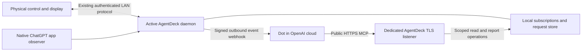

# Dot integration through MCP Events

Status: direct HTTPS hosting implemented in the isolated worktree, 2026-10-09; not deployed or submitted. Repository baseline: `fdd902d4`.

The [direct-hosting runtime](../services/dot-relay/README.md) now includes native macOS TLS/MCP, local OAuth consent and Keychain custody, native briefing UI, Node daemon ownership integration and local operator commands. No external OAuth provider or middle server is required. Generated schemas and security budgets keep the two implementations aligned. Local tests cover real TLS, consent, token issuance, restart/revocation, signed callback mechanics and request/report lifecycles. Public DNS/trusted production identity, real Dot account interoperability, signed distribution validation and physical-device acceptance remain release gates. Existing app/daemon installation has not been changed.

Build an opt-in integration that lets a physical AgentDeck action request work from Dot and displays the result that Dot reports. Use MCP Events for AgentDeck → Dot delivery and authenticated MCP tools for Dot → AgentDeck reporting. Keep ChatGPT app presence, reported Dot work, and transport health separate. A public Dot-wide lifecycle or approval API has not been established; this design does not require one.

The first milestone is a briefing round trip, with a real Dot interoperability experiment before broad UI or firmware work. AgentDeck itself hosts HTTPS MCP. No separate AgentDeck cloud relay is part of this design. While AgentDeck is stopped or the Mac is asleep, context reads and reports cannot reach it; Dot may continue unrelated cloud work, but recovery of missed reports is not guaranteed. Existing local AgentDeck functionality remains usable without this integration.

The adopted visual contract for all surface families is [Dot Creature Surface Design](dot-creature-surfaces.md). It owns appearance and relationship visualization; this plan owns implementation sequencing and interoperability evidence.

## Evidence and boundaries

| Evidence | Consequence |
|---|---|
| Dot has a cloud computer and can continue cloud work while a personal computer is off. Personal-computer work requires that computer online and ChatGPT open. | Quitting ChatGPT is a local-availability signal, never a Dot completion signal. [Computers and apps](https://learn.chatgpt.com/docs/dots/computers-and-apps) |
| Pausing Dot does not stop every delegated task or cancel future schedules. | No global pause/stop button without an actual supported control contract. [Controls](https://learn.chatgpt.com/docs/dots/controls) |
| Events support Work Cloud and dots, subject to workspace controls; integration uses MCP 2.0 version `2026-07-28`. | Verify actual account access and server discovery before committing to a production SDK. [MCP Events](https://developers.openai.com/plugins/build/mcp-events) |
| ChatGPT subscribes to the application's events and supplies a callback URL and signing secret. | AgentDeck hosts the event source; this is not a Dot lifecycle webhook subscription. |
| Webhook `2xx` acknowledges receipt; processing is asynchronous, can batch events, and can be out of order. | Delivery, reported work, and completion have different states and clocks. |
| Customer-specific data and write tools require authenticated users; documented plugin integration uses OAuth 2.1. | Separate MCP user authorization from device credentials and existing LAN pairing tokens. [Authentication](https://developers.openai.com/plugins/build/auth) |
| Private MCP tunnels are for private connections/testing, not public plugin distribution. | Do not make a bundled tunnel helper part of the App Store design. [Secure tunnels](https://developers.openai.com/api/docs/guides/secure-mcp-tunnels) |
| A prior research probe successfully read ChatGPT installation/running state from a separately sandboxed Swift app. Installed ChatGPT used `com.openai.codex`. | Native app presence is feasible. This was not the submitted AgentDeck Release archive and does not establish local-executor readiness. |
| Read-only inspection of installed ChatGPT found `threadSource: aeon` and separate executor readiness; local DB had no `aeon` rows. | Treat these as unvalidated adapter research, not production dependencies or proof of Dot identity. |

The previous research could not inspect ChatGPT's live UI because the computer-use tool rejected access to `com.openai.codex`. App quit/resume behavior of an actual Dot task remains unmeasured. Conduct that experiment in a supported client/test environment; do not bypass that restriction.

Local hooks are not a cloud Dot audit stream. Enterprise remote MCP hooks have a narrower, managed-account contract. [Cloud and local access](https://learn.chatgpt.com/docs/enterprise/cloud-local-access#check-hooks-and-network-compatibility)

## First user experience

1. The user opts into direct HTTPS MCP hosting, supplies a DNS hostname and a matching publicly trusted certificate, and configures external reachability. AgentDeck keeps this listener separate from its LAN daemon. No automatic router/firewall changes.
2. The user connects the private MCP endpoint in ChatGPT, approves the connection in AgentDeck, and asks Dot to monitor briefing requests for one integration profile. Local OAuth consent is implemented in the native app and Node operator path.
3. AgentDeck shows subscription availability only after callback verification and durable storage. This does not establish global Dot health.
4. The user presses **Ask Dot for a briefing** and approves the bounded context. AgentDeck stores the request locally and sends its signed event directly to OpenAI's callback.
5. Dot calls the same public AgentDeck HTTPS endpoint to read, claim and report the request.
6. AgentDeck displays the report and its absolute receipt time. After sleep/restart, it retains prior reports and retries only unexpired pending events. A previously accepted event does not imply that a report lost during downtime will be replayed.

MVP scope: one integration profile, one primary event subscription, one explicit briefing event, read-only context tools and bounded report writes, desktop display, and one physical button. Do not promise observation of every unrelated Dot responsibility. `needs_attention` can display a reported issue, but MVP does not remotely approve OpenAI actions.

Do not add a new Stream Deck action UUID for the experiment. First verify whether a capability-gated existing action can expose the request; otherwise keep the first control in the native app and decide a new immutable action deliberately during the device milestone.

## Architecture

### Direct hosting decision

The user selected direct HTTPS hosting on 2026-10-09, superseding the earlier always-on relay proposal and the provisional single-Linux-server deployment choice. There is no hosted relay, cloud device sync, required tunnel, or AgentDeck cloud account in the selected architecture. `services/dot-relay/` remains the historical path for the isolated protocol experiment; it is not a product runtime dependency.

The public listener has its own port, TLS identity, OAuth gate and strict route allow-list. **Never forward port 9120 or 9121–9139 to the internet.** Native local actions use the store directly; existing authenticated LAN clients continue through the hub. Neither device creation/control routes, hooks, daemon health, shutdown, nor LAN pairing tokens belong on public ingress.

A stable DNS name, publicly trusted certificate/private key and an inbound path are prerequisites. External port 443 may map to the dedicated unprivileged listener, such as 9476. DNS and local TLS success do not prove external reachability. Validate from a network outside the LAN. CGNAT, double NAT, ISP filters and blocked IPv6 may prevent direct hosting; report unavailable/unknown without silently installing a tunnel. Do not infer reachability from a public-looking address alone. No automatic UPnP or firewall changes.

Certificate import is the first supported provisioning design; automatic ACME issuance/renewal is not assumed. Native code stores the user-selected PKCS#12 envelope in Keychain, imports its identity in memory through Security.framework, and validates hostname/chain/validity. Private keys are not kept in preferences. The user remains responsible for renewal until a tested native renewal flow exists. Stop accepting new work if identity validation fails; do not fall back to HTTP. Certificate replacement must have bounded restart and rollback behavior without disturbing the LAN daemon.

Swift uses a separate Network.framework TLS listener with Security.framework identity and native HTTP/MCP handlers under the daemon isolation boundary. The App Store implementation launches no Node, shell, certificate helper or tunnel binary. Node implements equivalent HTTPS contracts for CLI users. Both use their own supported data directory; neither reads the other's container. The bound daemon owns requests and device projection, and a handover must stop its public listener before the replacement starts.

The current experiment terminates TLS directly in Node and separates public MCP from loopback operator routes. JWT issuer/JWKS authentication remains only a test adapter. The implemented native and Node local authorization servers supply OAuth metadata, authorization-code + S256 PKCE, exact registered redirect matching, one-use expiring codes, scoped/rotating/revocable tokens, and explicit approval in the local app. Browser visits alone cannot authorize access. Prefer pre-registered clients initially; do not implement unrestricted dynamic registration or remote client metadata fetching without corresponding validation. Verify actual ChatGPT support before freezing this contract. No OpenAI cookies or API credentials are copied.

The local store owns subscriptions, outbox, contexts and reports. No second model runs in AgentDeck. Dot performs the work under the user's subscription and instructions. ChatGPT app presence is observational only; closing ChatGPT is not the same as stopping AgentDeck's listener or Dot cloud work.

## Contracts to implement

All names below are proposed AgentDeck contracts, not fields supplied by OpenAI.

| Contract | Purpose |
|---|---|
| `agentdeck.briefing.requested` event | One explicit user request, filtered by integration profile. Carries request ID, context revision, occurrence time and expiry; no full transcript. |
| `get_request(requestId)` | Returns current status, expiry, authorized context references and allowed response form. Expired requests or requests whose account authorization was revoked are not executable; a stopped local endpoint cannot serve these tools, without asserting that Dot has stopped. |
| `get_context(requestId)` | Returns only the context explicitly shared with this request, including captured time and missing/stale markers. Not an arbitrary file reader. |
| `claim_request(requestId, idempotencyKey)` | Creates a bounded processing attempt; an identical retry returns that attempt, while a competing claim returns already claimed. A compare-and-set prevents concurrent duplicate consumers from both obtaining an attempt. |
| `report_update(requestId, attemptId, sequence, idempotencyKey, ...)` | Reports work, an informational attention request, completion or failure. Validates ownership, attempt generation, increasing sequence and output limits. |
| `report_interaction(requestId, attemptId, relationId, sequence, ...)` | Records a reported delegation, message, control, result or attention relationship. Direction, target reference and kind remain fixed per relation. This is evidence storage, not an execution or approval API. |
| Local request/report projection | The active daemon persists and publishes snapshots to existing authenticated device clients. No cloud device credential or sync API is required. |

A completion includes a bounded summary, optional validated result links and an explicit outcome. It does not assert a PR merged, a deployment succeeded or another external action happened without supplied evidence. Render report text as inert text, escape markup and strip terminal control sequences; never execute content as a command. Links use an allowed scheme and user-initiated opening; there is no invented Dot deep link.

Initial tools do not expose `stop_dot`, `approve_openai_action`, `execute_shell`, remote desktop control, token retrieval or arbitrary HTTP fetches. Read tools are annotated read-only; claim/report tools are write tools with honest annotations. Test whether their approvals permit the intended user-authorized event workflow rather than labelling writes as reads to suppress prompts.

### Identity and authorization

- Derive the account from the validated OAuth token, never from model-supplied `accountId`.
- AgentDeck allocates `integrationId`, `requestId` and attempt identities. OAuth identifies the linked user; it does not authenticate a particular Dot persona or expose a Dot ID.
- A user-selected profile label can say “My Dot”; record reported actor labels as unverified descriptions. Binding multiple dots or chats requires an explicit routing design, not guesses based on a callback URL or local project directory.
- Permit one primary briefing subscription per profile in the MVP. An identical subscribe refreshes it. A conflicting subscriber requires an explicit profile rebind rather than silent takeover or fan-out.
- An accepted report proves an authorized tool write about that request, not continuous global Dot telemetry. Tenant isolation applies to every read, claim, report, subscription and local projection operation.
- MCP OAuth access and LAN pairing tokens are different credentials. Never expose a LAN token through MCP or copy OpenAI session cookies.
- Host the selected authorization flow locally, with the requirements above. The existing external JWT provider adapter is only an interoperability aid. Store native token secrets in Keychain, enforce scope/resource and expiry, and revoke subscriptions together with their authorization grant. Never use an unauthenticated public endpoint.
- Physical devices retain existing LAN pairing. They do not receive OAuth tokens or connect to OpenAI directly.

### Request and display states

Track transport and reported execution separately:

| Dimension | Values and interpretation |
|---|---|
| Request delivery | `stored_local`, `pending_delivery`, `webhook_accepted`, `delivery_failed`, `expired` |
| Reported execution | `unreported`, `claimed`, `working`, `needs_attention`, `completed`, `failed` |
| Subscription | `unconfigured`, `verifying`, `active`, `expired`, `revoked`, `unavailable` |
| Observation | TLS listener state, separately measured public reachability, last report time and context capture time, independently |
| This Mac | ChatGPT `running`, `not_running`, `unknown`; executor readiness remains `unknown` unless independently established |

Webhook receipt never sets `working`. Silence never sets `completed`, `idle` or `paused`. “Reported work” describes this integration's known requests, not Dot's total workload. A request expiry does not terminate Dot; a late result can be preserved as late history without reactivating an expired button or overwriting a newer attempt.

A claim lease deduplicates processing attempts but is not proof that work continues. Do not automatically re-run an expired claimed attempt just because it stopped reporting. A new attempt requires an explicit retry policy/user action; reject writes from an older generation. Request cancellation before dispatch can stop delivery, but after dispatch it cannot be presented as a confirmed remote stop.

Use server-assigned revisions and attempt sequences for ordering. Keep source occurrence time and receiver time separate. Internal wire timestamps are integer epoch milliseconds; MCP event timestamps are ISO 8601 with a timezone. A listener health probe updates transport health, not the report's freshness. E-ink uses absolute timestamps because the image may persist while unpowered.

## Event transport implementation

Implement `server/discover` with Events capability and `events/list`, `events/subscribe`, `events/unsubscribe` on the authenticated MCP endpoint. The server applies profile filters and resource authorization before delivery. These methods are protocol endpoints, not ordinary tools with similar names.

Subscription creation uses canonical arguments and the authenticated principal, callback URL and event name for deterministic identity. Persist the signing secret, owner, filters and expiry across restarts. Hash internal identities where useful; never expose or log secrets through IDs. A repeated subscription refreshes the existing record. Unsubscribe is idempotent and immediately cancels unsent matching deliveries.

Before activation, validate the `whsec_` secret and perform the signed single-use challenge exchange. Require HTTPS, validate resolved addresses at connection time, preserve hostname verification, reject private/local destinations and redirects, and bound request duration. The same protections apply to challenge and delivery. This needs DNS-rebinding and redirect tests, not just a string-prefix URL check.

Use Standard Webhooks over the exact serialized bytes. Preserve `eventId` across retries; generate a fresh signing timestamp/signature for each attempt. One event per request, with the official maximum of 256 KiB. AgentDeck will choose a smaller application payload budget in the contract PR. Retry transient errors with bounded backoff/jitter, respect applicable retry hints, and do not retry `410` or `413`. Mark `410` delivery stopped and surface that the subscription needs attention; `413` is a payload failure, not proof that the whole subscription was revoked. Other permanent authentication/validation failures need explicit handling, not an infinite retry loop.

Store the event and outbox work transactionally before acknowledging local persistence. A timeout after sending is an ambiguous receipt; retry the same event ID. All writes and display projections deduplicate independently because exactly-once end-to-end execution is not promised.

Phase 0 advertises `cursor: null` and claims no protocol replay. Production replay, if implemented, uses a per-subscription filtered durable log and a cursor that cannot skip pending deliveries; test gaps, partial delivery, access revocation and `truncated: true` when retention has removed history. A reconnecting device uses daemon snapshot-plus-revision sync even if MCP replay is unavailable. Do not emit unsupported MCP `gap` or `terminated` controls.

Respect finite `refreshBefore` expiry on every delivery. Support `ttlMs` and secret replacement according to the official contract, including the bounded dual-signature rotation window. A process restart must not renew an expired subscription. Recheck authorization while a subscription is active.

Prevent feedback loops structurally: Dot's report writes produce local display updates, never another briefing-request event. Only a new explicit user request creates that event. Later automated events need separate opt-in rules, origin/causation IDs, budgets and loop tests. A dashboard refresh or device keepalive never wakes Dot.

## Existing AgentDeck integration points

| Area | Existing boundary | Planned change |
|---|---|---|
| Domain contracts | [shared/src/protocol.ts](../shared/src/protocol.ts), [shared/src/adapter.ts](../shared/src/adapter.ts) | New focused request/report contracts and shared state reducers. Do not force the resident Dot into a PTY `AgentAdapter`. Add generated transport fields only when a consumer is implemented. |
| Node hub | [bridge/src/daemon-server.ts](../bridge/src/daemon-server.ts) | Dedicated direct HTTPS listener and report store; no per-session bridge or relay client. |
| Swift hub | [DaemonService.swift](../apple/AgentDeck/Daemon/DaemonService.swift), [DaemonServer.swift](../apple/AgentDeck/Daemon/Server/DaemonServer.swift) | Native TLS/MCP server, local OAuth consent and store; bounded I/O and daemon-ownership guards. |
| Native presence | [SingletonGuard.swift](../apple/AgentDeck/App/SingletonGuard.swift), [DisplayMonitor.swift](../apple/AgentDeck/Daemon/System/DisplayMonitor.swift) | A separate ChatGPT app-presence observer using NSWorkspace; presence is not reported Dot execution. |
| Portable displays | [bridge/src/card-feed.ts](../bridge/src/card-feed.ts), [bridge/src/card-modules.ts](../bridge/src/card-modules.ts) | Project briefings as bounded read-only module cards. Reuse existing `pulse`/`thread` semantics only where truthful; a distinct new module needs capability/decoder compatibility checks. |
| Surface boundary | [docs/surface-protocol.md](surface-protocol.md) | Additive, allow-listed capabilities for requesting a briefing and reading reports. Do not export the entire internal protocol or confer existing permission-decision authority. |
| Desktop and physical buttons | Native UI, `plugin/`, later `plugin-ulanzi/` | Capability-gated request control plus delivery/result states. App-only control can precede hardware integration. |
| Aquarium | Existing provider/creature projections | Persistent Dot resident is a later projection over reported work, not a fake session used to inflate counts. New provider identity requires all allow-lists and generated mirrors. |

Card Feed reuse is an architectural opportunity, not existing feature parity. Node currently supports module producers and `card_choice`; Swift's portable feed builds a narrower read-only projection. Implement both daemons deliberately. The Node `card_choice` branch routes to the module before live-session validation, so a future Dot question module must validate its own authoritative question ID, revision, expiry and answer eligibility. Setting `actionClass: live` alone is insufficient.

The first card is `info` with no answer buttons. In a later phase, only actual Dot-authored choices can be offered. An answer is ordinary user input to a question; it never substitutes for an OpenAI approval. Recheck eligibility when accepting a queued answer and when Dot reads it. A stale choice cannot acquire the meaning of a revised question.

## App Store and operational boundaries

Before runtime implementation, add explicitly planned rows to [the feature matrix](appstore-feature-matrix.md), then update them with measured support. Preserve the [Swift daemon rules](../.claude/rules/swift-daemon.md), [lifecycle and pairing rules](../.claude/rules/daemon-lifecycle.md), and [wire rules](../.claude/rules/devices-and-wire.md).

The existing [entitlements](../apple/AgentDeck/Resources/AgentDeck.entitlements) support native client networking. ChatGPT installation/running detection and user-initiated app opening use native APIs; there is no private IPC, UI scraping or injection. Lack of a verified Dot deep link means offering a generic app-open action only.

Direct hosting is optional and disabled by default. There is no AgentDeck-operated cloud backend. Update [review notes](../apple/APP_REVIEW_NOTES.md), privacy disclosures, certificate and authorization consent, disconnect/deletion behavior and the actual outbound context flow before distribution. Native APIs make an implementation feasible but do not establish App Review approval.

Implemented retention: shared context is erased at request expiry (30 minutes); request/report history is removed after seven days on the next running maintenance pass. No raw transcript upload. Keep only bounded, content-free delivery diagnostics and the deduplication records needed through the retry/retention horizon. Explicit deletion/revocation purges queued payloads and cached personal content according to the selected policy. This is a proposed product default, not an OpenAI requirement.

The endpoint is unavailable when AgentDeck is stopped or the Mac is asleep. Existing report cards remain historical data; no always-online promise, independent cloud client, APNs delivery or direct-to-cloud firmware is included.

## Experiments and acceptance gates

Phase 0 is a compatibility experiment, not a production rollout. A local fake callback proves protocol mechanics but cannot prove Dot behavior. Actual success requires a supported account, a reachable authenticated MCP endpoint and a user-established subscription.

| Experiment | Procedure | Pass evidence and decision |
|---|---|---|
| Protocol discovery | Use the chosen SDK/adapter with MCP 2.0; connect a test plugin and rescan tools/events. | Actual `server/discover` and `events/list` exchanges. If unsupported, isolate a compatible protocol adapter before UI work. |
| Account and subscription | In a real Dot, subscribe to a test profile; verify challenge and persistence; repeat and unsubscribe. | One canonical subscription, correct filtering, no delivery after unsubscribe. A Work Cloud test is a useful baseline but does not replace the Dot test. |
| Round trip | Send one briefing request, let Dot read/claim/report, read the local report. | Correlated request ID throughout; report visible once; record any approval prompt. `2xx` alone fails this gate. |
| App lifecycle | Repeat cloud-only work with ChatGPT frontmost, backgrounded, window closed and fully quit. Separately test a local-computer-dependent request. | Endpoint and app-presence traces; measure actual completion/attention behavior instead of assuming automatic migration. Run quit tests from a separate client so the test harness survives. |
| Mac unavailable | Stop AgentDeck and attempt a read/report; restart and separately test sleep/wake. | Unavailable endpoint is reported honestly; prior durable reports survive; pending events respect expiry; no claim that a missed remote report is recoverable. |
| Duplicate and reordered work | Duplicate callbacks, delayed old reports, lease expiry, two subscribers and multiple requests batched into one Dot run. | No duplicate card or harmful replay; each request retains its identity; older attempt cannot overwrite newer state. |
| Subscription recovery | Restart service, refresh expiry/secret, revoke resource access and unlink account. | Persistence/rotation correct; revoked access stops both new reads and queued delivery. |
| Callback failures | Challenge mismatch, bad secret/signature, timeout, redirect, private destination, `410`, `413` and transient failures. | Categorized, bounded failure; no data sent to unverified callback and no retry storm. |
| Native release | Run the self-contained Swift path in a signed Release sandbox and disconnect the optional Node daemon. | Native operation works; archive verifier passes; no helper requirement. |
| Device rendering | Show report on desktop plus one physical target; reboot/reconnect while report is cached. | Readable Korean byte limits, absolute e-ink time, no false action buttons or duplicate notifications. |

Record separate timings for local persistence, webhook receipt, first report, final report and device display. Start with at least ten correlated ordinary round trips and explicit failure injections; this is pilot evidence, not an SLA. Report sample counts and latency distributions without promising an unmeasured response time.

If reporting tools repeatedly need manual approval or Dot does not reliably act on the subscription, narrow the product to an explicit request/result inbox and keep app presence separate. Do not ship an “always-live Dot monitor” on the strength of a mock server. If MCP Events is unavailable to the user's account, mark the live gate unverified and retain the protocol experiment rather than switching to private APIs.

## Implementation sequence

| Step | Deliverable | Exit condition |
|---|---|---|
| 0. Interoperability spike | Isolated MCP endpoint, one event, five tools, real Dot test records, SDK/auth choice | Discovery, subscription and real request/report round trip pass. No firmware or public-service commitment yet. |
| 1. Direct-hosting foundation | Trusted TLS identity, separate listener, reachability diagnostics, local OAuth consent, durable store and revocation | Failure/tenant-isolation tests pass; storage/retry/expiry semantics pinned. Freeze v1 contracts only after step 0. |
| 2. Daemon parity | Node HTTPS server and native Swift TLS/MCP server, separate app-presence observer, persisted cache and ownership handling | Identical fixture outcomes; either daemon can own the hub without duplicate publishing. |
| 3. First usable surface | Native briefing UI plus one physical control/display; read-only feed projection | Real button-to-Dot-to-display round trip, including offline recovery, with no fake session or approval. |
| 4. Private pilot and release | Minimal onboarding, user opt-in, diagnostics, privacy/review updates and Release validation | Real lifecycle/permission behavior documented; supported account and service operation defined. |
| 5. Richer interaction | Actual Dot questions and response events, opt-in agent-attention notifications, resident visualization | Question revision/expiry tests, causal-loop prevention, capability negotiation and all relevant surfaces validated. |

Suggested new modules, after the spike: `shared/src/dot-integration.ts`, `shared/src/dot-integration-rules.ts`, a separate `services/dot-relay/` package, `bridge/src/dot-mcp-server.ts`, `bridge/src/dot-report-store.ts`, and Swift counterparts under `apple/AgentDeck/Daemon/Dot/`. The current implementation uses `shared/src/dot-rules.ts`, `bridge/src/dot-host.ts`, `bridge/src/dot-cli.ts`, the historical `services/dot-relay/` directory and the native Dot directory. Keep a small relay-specific public schema separate from the full internal `protocol.ts`.

Define numeric budgets, expiry policy, display-state mapping and protocol bounds once in shared sources and generate/mirror native consumers with drift tests. Add the row to the architecture SSOT catalogue when implemented. Persistent schema versions need migration tests. After a reconnect, atomically apply a snapshot with its high-water revision before later deltas; reject deltas from an older connection epoch.

Before merging executable changes, run the repository's build, typecheck and tests, protocol generation with no drift, design lint/token checks and the applicable Swift/native gates. Register new verification areas in `scripts/verification-catalog.json` in the same change. Release additionally requires the App Store archive verifier and measured runtime evidence; a debug build is insufficient.

Documentation-only updates require `pnpm docs:check` and `pnpm design-system:check`. The document is excluded from the shipped design catalogue with a reason because it describes proposed work.

## Local implementation evidence — 2026-10-09

- `pnpm build` and `pnpm typecheck` pass, including the distributable Node runtime bundle. A separate smoke test imported that bundle and verified its real TLS handshake and local OAuth metadata.
- Before the companion iteration, Vitest with coverage: 343 files pass, 5,137 tests pass and two skip. Overall coverage is 61.43% lines, 60.43% statements, 57.15% branches and 62.05% functions, above the existing thresholds.
- Native macOS XCTest: ten tests pass, including companion state transitions and a rendered SwiftUI preview, alongside strict HTTP framing, callback address classification, a Node/Swift signature fixture containing Korean text, OAuth restart/replay, schema boundaries and a subscription-to-report lifecycle.
- iOS Simulator build passes; the direct host remains macOS-only.
- The final relationship/3D iteration macOS Release archive builds successfully. A separate ad-hoc-signed copy passes `verify-appstore-archive.sh` (sandbox entitlements, no subprocess/helper/install prompts). This verifies archive invariants, not organization distribution signing, provisioning or App Store acceptance.
- Relationship/3D iteration: full Vitest passes 344 files / 5,143 tests (two skipped). Both daemon card projections are read-only; a regression test checks UTF-8 bounds, retention and conditional-feed invalidation.
- Protocol generation leaves no changes under `generated/`. Documentation, design catalogue and token mirrors pass. Design lint retains 92 existing findings; none belongs to a changed file.
- Real loopback HTTPS exercises local approval, PKCE token exchange, protected MCP access, public/operator route isolation and durable revocation. Fake callbacks exercise event delivery; they are not evidence of real Dot execution.

The native Dashboard now shows a separate Dot companion after configuration, with an original light-orb appearance. It opens the native request/result panel and never adds a synthetic coding session. Only a fresh working report animates work; stale/future reports, delivery-only receipts, stopped hosting and expired requests do not. A short completion reaction returns to rest. ChatGPT macOS app presence is displayed separately using NSWorkspace; it does not determine cloud work state. Optional resume-on-launch is explicitly user-selected and disabled by default.

The native 3D aquarium now hosts a separate original Dot orb. It uses the same state resolver and semantic palette as the 2D companion, respects Reduce Motion/background playback, and opens the request/relationship panel on tap. It never receives a session ID or changes agent counts. Native tests exercise geometry, session separation, stale-report motion and the relationship panel; the assembled 3D scene still needs human visual acceptance.

`report_interaction` records up to 16 events per briefing. Both runtimes validate ownership, active claim, immutable relation identity, increasing sequence, monotonic stages, terminal states and idempotency. Restart validates stored event schemas, provenance and transitions. Every event is explicitly `dot_report`: even a reported `accepted` or `completed` stage is **not** an independently observed target acknowledgement. A target reference does not bind a roster session. Direction, kind, stage, source, timestamp and history are visible in the native panel; compact read-only feed cards carry the same meaning. Reports never invoke agent control or generate new request events.

The UI previews are rendered from explicit test reports, not a live Dot account. Full 3D/pixel/e-ink creature parity, remote-client companion state, target-side acknowledgement correlation and physical-button initiation remain follow-up work; the current portable fallback is an informational card, not a claimed native creature on every surface.

Both daemons now project received reports into read-only `dot` module cards, with bounded UTF-8 text, absolute report times and a seven-day retention filter. Their content participates in the existing conditional-feed signature. Existing clients may skip an unfamiliar module. No response choices, new agent type, firmware or immutable Stream Deck action UUID have been introduced. The physical-button initiation workflow, real-device display acceptance and remote-client creature propagation remain outstanding; the creature currently observes the in-process macOS host only.

A production hostname/identity, inbound route and supported Dot connection are still absent. Consequently actual Dot discovery/subscription/reporting, ChatGPT quit/sleep behavior and a physical button-to-Dot round trip cannot be marked passed. The local machine also lacks the required organization distribution identity; a locally built or ad-hoc-signed archive is not an App Store submission candidate. No running installation, router or account connection was changed.

## Decisions and deferred scope

Proceed now with the architecture and bounded interoperability spike. Do not wait for a public Dot status API. The direct-hosting choice is fixed. Native OAuth and certificate import are implemented; production identity provisioning and real internet reachability remain external acceptance gates; a separate service is not a fallback to introduce silently.

Prioritize briefing requests, a result inbox and honest app/transport status. Later candidates are return-to-desk digests, user-authorized attention escalation, evidence-backed delegation links and device-aware output. Global Dot stop, arbitrary remote control, inferred usage/cost, persistent screenshots, private runtime introspection and direct-to-cloud firmware are outside v1.

Recheck the dated OpenAI contract before implementation: [MCP Events](https://developers.openai.com/plugins/build/mcp-events), [plugin authentication](https://developers.openai.com/plugins/build/auth), [Dot controls](https://learn.chatgpt.com/docs/dots/controls), [computers and apps](https://learn.chatgpt.com/docs/dots/computers-and-apps), and [tasks and memory](https://learn.chatgpt.com/docs/dots/tasks-and-memory). SDK support and account availability are explicit live gates, not inferred from documentation availability.

## Fixed deck key implementation — 2026-10-09

Node and Swift now publish the sanitized `sessions_list.dot` snapshot. Stream Deck and Ulanzi render a shared static orb/status key first on every list page when configured, preserving Hermes/OpenClaw ordering and actual session counts. Disconnect/legacy absence clears cached state; stopped hosting remains explicit. Pagination and sparse-grid guards keep sessions reachable, including usage-gauge configurations. Dot presses are inert.

Validation covers producer snapshots, renderer age/future/expiry behavior, both plugin caches/layouts and native snapshot/preview parity. This is source-level support, not installed plugin or hardware acceptance. Native preview input plumbing, deck relationship detail, richer remote creature state and real Dot-account interoperability remain separate follow-ups.
