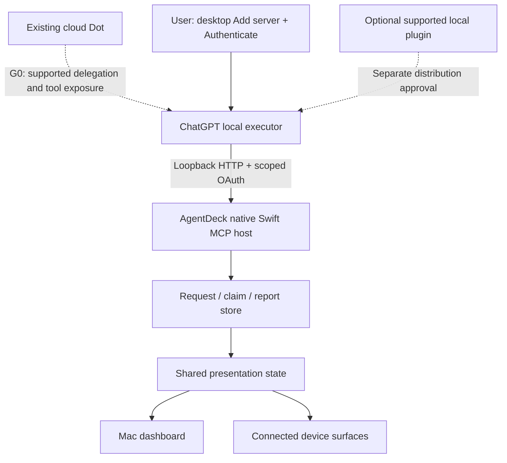

# Dot integration: server-free App Store release plan

Reviewed: **2026-10-11**. This is a conditional delivery plan, not a declaration of platform approval or a shipped feature. It supersedes the ordering of the older [distribution plan](dot-distribution-decision.md#implementation-and-validation-order). The [feature matrix](appstore-feature-matrix.md) owns the App Store capability boundary; the [Korean overview](dot-connection-explained.ko.md) explains the decision to users.

## Decision

Keep the no-public-server requirement. Target an **in-process Swift MCP host reached by an officially supported local ChatGPT executor**. Investigate the documented desktop **Add server + OAuth** flow first; public plugin directory admission is a separate, potentially smoother distribution route. Do not assume every local integration needs a public directory listing.

There is currently **no verified complete route for ordinary users' existing Dot** that satisfies this product contract. A documented local Codex MCP client is available, but Dot's access to that client's tools remains unproven. Our earlier Dot-created task lacked those tools. Public plugin documentation sends local-only providers to OpenAI for support; the private tunnel is explicitly not public distribution. These are different blockers, not one generic “MCP unsupported” conclusion.

An App Store launch of automatic Dot integration is **no-go until the local route passes Gate 0** below. AgentDeck's independent features can continue releasing. Do not add more device work or embed a tunnel binary to conceal an unresolved transport gate.

“App only” means AgentDeck needs no additional AgentDeck helper, Node runtime, terminal setup, Platform key, tunnel identity, public port, domain or hosted backend. Users still need eligible Dot access, the existing ChatGPT desktop app, computer permission and explicit local authorization. This is not an offline product. Public documentation/privacy pages or a static client metadata document are distinct from operating a public MCP service; prefer OpenAI-hosted client metadata where supported.

## Official evidence and its limits

| Route | What is officially documented | What remains missing | Decision |
|---|---|---|---|
| Desktop local HTTP MCP | ChatGPT desktop Settings → MCP servers → Add server accepts Streamable HTTP; Authenticate starts OAuth. Same-host Codex clients share configuration. [MCP documentation](https://learn.chatgpt.com/docs/extend/mcp) | Whether Dot's chosen executor inherits the tools; consumer account eligibility; GUI-only authentication with AgentDeck | First feasibility experiment; does not require assuming public plugin admission |
| Dot computer access | Dot can create local Work/Codex tasks and continue local Codex tasks; computer must be online with ChatGPT open. [Computers and apps](https://learn.chatgpt.com/docs/dots/computers-and-apps) | A cloud-coordinated task using local files is not necessarily a local MCP-capable executor | Prove tool availability and execution provenance on the actual Dot-created task |
| Public local MCP plugin | Public submission requires remote HTTPS; local-only providers are directed to their OpenAI contact. [Packaging](https://developers.openai.com/plugins/build/plugins#bundled-mcp-servers-and-lifecycle-hooks) | Supported third-party local registration, eligibility, install/update and authentication contract | Request official local-MCP support for directory distribution; no promise of one-click installation |
| Private workspace plugin | Admin publication distributes within the workspace/org. [Workspace publication](https://developers.openai.com/plugins/build/plugins#publish-a-local-plugin-to-your-workspace) | Availability outside that workspace and Dot's local execution path | Team pilot, not arbitrary consumer distribution |
| Official Secure MCP Tunnel | Outbound client reaches a private MCP server. Public plugin submission/distribution is excluded. [Tunnel guide](https://developers.openai.com/api/docs/guides/secure-mcp-tunnels) | A documented native embedding/provisioning route for consumer apps; public distribution permission | Keep current experiment private; do not ship publisher credentials or require user API keys |
| Skills-only package | MCP configuration is excluded; persistent credentials/settings need MCP in the migration guidance. [Supported migration scope](https://developers.openai.com/plugins/guides/submit-claude-plugin#review-what-openai-supports) | Skills alone do not install authenticated local transport | Optional instructions only; no token-in-prompt or shell-script workaround |
| Sign in with ChatGPT | Identity and eligible model-usage flows have distinct scopes. [Identity](https://developers.openai.com/siwc/website), [model usage](https://developers.openai.com/siwc/token-sharing-open-source) | Neither establishes a route to the user's existing Dot | Do not build an account backend to solve a transport problem |
| MCP Events | Authorized server-originated events can activate a workflow. [Events](https://developers.openai.com/plugins/build/mcp-events) | Supported subscription, callback and return-tool path | Optional subsequent release; not a feed of all Dot activity |
| App Intents / Shortcuts | Apple exposes app actions to its system experiences. App Shortcuts are not supported on macOS; App Intents actions can participate in user-created Mac shortcuts. [Apple guidance](https://developer.apple.com/design/human-interface-guidelines/app-shortcuts) | No reviewed OpenAI contract establishes automatic Dot discovery/invocation or authenticated reporting | Useful generic automation later; not the chosen Dot transport |
| Native computer use / browser UI | Dot has computer access, subject to execution environment and permissions. [Computers and apps](https://learn.chatgpt.com/docs/dots/computers-and-apps) | Reliable unattended execution, locked-screen behavior, caller identity and progress reporting | A bounded usability experiment only; clicking a status control does not prove a Dot-originated report |

No public personal-Dot global-status, automatic avatar export or general remote-control API was established by this review. This is a bounded finding, not a claim about undisclosed interfaces. A public HTTPS reverse proxy, including a managed tunnel/Funnel, still exposes a public MCP endpoint and changes the selected constraint.

## What the implementation actually proves

The merged [PR #501](https://github.com/puritysb/AgentDeck/pull/501) and dated [validation record](dot-distribution-decision.md#real-account-validation) prove a useful private chain: real Dot calls, correlated request claims and reports, Node daemon state, Mac creature motion/completion and rendered Pixoo preview updates. The installed-main trial also measured report-to-WebSocket delays of approximately 650 ms and 2,263 ms. These are observations from one trial, not latency guarantees. Physical Pixoo photography and all-device acceptance were not completed.

That chain still uses an external official tunnel client, Node adapter and Node daemon. It proves neither app-only execution nor a signed sandboxed Swift Release. Earlier local-task failure happened before `get_request`; another consent approval cannot fix absent tools.

Source inspection identifies a concrete local-onboarding gap:

- [DotOAuth.swift](../apple/AgentDeck/Daemon/Dot/DotOAuth.swift) advertises PKCE, public-client authentication and issuer-bound responses, but validates a pre-registered client ID. It does not advertise DCR or CIMD. The local redirect validator requires the shared callback path and a valid loopback port.
- [DotHost.swift](../apple/AgentDeck/Daemon/Dot/DotHost.swift) configures the local listener and native consent. The [private plugin README](../integrations/chatgpt-local/README.md) already records the pre-registration limitation.
- Official desktop documentation supports automatic CIMD/DCR as well as pre-registration. Its GUI instructions do not establish a GUI field for our fixed client ID. A generic Add server flow therefore cannot be assumed to authenticate against today's implementation.
- [App entitlements](../apple/AgentDeck/Resources/AgentDeck.entitlements) already declare Sandbox plus incoming/outgoing network permissions. This is source evidence, not proof of the entitlements or behavior of a submitted archive.

## Target architecture and user experience

The dashed edge is the release blocker. Dot might delegate rather than directly call the tools. Preserve the delegating actor, authenticated local grant and actual executor separately. Model-written labels do not authenticate Dot identity.

Proposed initial flow, only after the relevant gates pass:

1. In AgentDeck, enable the local connection. Start the in-process listener; offer **Copy connection address**. Show its real readiness/error state.
2. In the existing ChatGPT desktop Settings, add that HTTP address and select Authenticate. Prefer the client's documented automatic registration so users enter no client IDs or secrets. Do not write another app's configuration or invent an install deep link.
3. Approve selected-context read and request-report scopes in AgentDeck. Computer access is a separate permission in Dot's profile when not already granted.
4. Give the existing Dot a one-time request reference. Verify actual read, claim and completion before showing **Ready**. Do not mark ready merely because the MCP client connected.
5. Persist revocable grants in Keychain. Reconnect without repeating valid permissions. Later add a one-click plugin only if OpenAI supplies a supported local distribution mechanism.

This intentionally permits a short settings-based first setup; it removes operational server/key management. It is not advertised as zero configuration. Measure whether non-developer testers can finish it unaided before launch.

### Native authentication work, conditional on feasibility

Choose **one documented registration mode** after checking the supported desktop versions. CIMD with trusted OpenAI-hosted metadata could avoid running a public registration service; DCR is an alternative if required by the supported client. Neither grants tool access without the user's local consent.

Keep S256 PKCE, state and issuer checks, exact resource/audience binding, bounded requests, loopback redirect validation, refresh rotation, expiry, revocation and Host/Origin protection. For CIMD, constrain metadata URLs/redirects and outbound fetches against SSRF; for DCR, bound registration volume and do not treat registration as authentication. Validate the exact client callback behavior documented in [MCP OAuth](https://learn.chatgpt.com/docs/extend/mcp). Do not loosen existing checks simply to make a login succeed. Never use ChatGPT session cookies or treat the first-party `auth=chatgpt` option as third-party authorization.

Changes to OAuth/resource rules require shared-contract ownership, Node/Swift parity and meaningful regression tests. Existing request/report/rendering code should be reused, not rewritten around the experimental tunnel.

## Release gates, in order

| Gate | Work and proof artifact | Pass criterion / stop condition |
|---|---|---|
| G0a: local execution feasibility | On an isolated supported desktop profile, configure native AgentDeck HTTP MCP using the documented host flow. Test local Codex, Dot-created local Codex, and cloud-coordinated local Work separately. Record host/executor identity and tool inventory, not just the working directory. | Existing Dot causes an authenticated correlated read → claim → working → completed without tunnel/Node adapter. A local Codex-only success is insufficient. If Dot tools remain absent, stop expanding implementation and resolve support with OpenAI. |
| G0b: supported onboarding | Check actual GUI registration capabilities. If registration alone blocks local auth, make a minimal CIMD/DCR compatibility spike first. Ask OpenAI the questions below about Dot propagation and public local distribution. | A documented, reproducible route for the selected ordinary-user accounts. Direct Add server does not require directory approval, but Dot tool propagation must be supported and demonstrated. A private partner exception is not general availability. |
| G1: native product implementation | Native registration/consent, connection health, revocation and reconnect UI. Retain request provenance and freshness. Update feature matrix and shared contracts before code changes. | No shell, companion prompt, external runtime or manual config/key editing. Existing ChatGPT account/computer grants remain distinct. |
| G2: fresh-user installation | At least two independent eligible accounts on clean Mac profiles without developer credentials or previously installed local plugins. One uses only documented GUI setup. | Install → consent → first actual Dot result, restart and revoke all succeed. Record versions, account/workspace restrictions and setup steps. No reliance on the developer's account, cached tools or workspace publishing. |
| G3: lifecycle/security | Ten real correlated request cycles plus negative cases below; Node absent and Swift owning the daemon for Store acceptance. | No stuck working, false completion, cross-grant access or unbounded wait. Timings and error recovery recorded. Unsupported execution contexts are identified explicitly. |
| G4: presentation | Actual Dot reports on Mac 2D/3D and supported connected surfaces. Verify Stream Deck, D200H and physical Pixoo if these are claimed at launch; ESP32/mobile by the claimed surface matrix. | Appearance, working, completion, stale and disconnected states match the shared rules. Rendered preview is not physical-device proof. Optional external device software is not required for the core Mac experience. |
| G5: App Store candidate | Full recorded verification; signed Release archive; archive verifier; TestFlight clean install; reviewer walkthrough, privacy and accurate metadata. | All advertised capabilities work in the exact candidate. Core AgentDeck remains useful without Dot. Separate platform support from Apple approval. |
| G6: distribution | Follow the Apple release workflow and any separately required OpenAI distribution review. | Track CI success, artifact, upload, submission and live availability separately. Announce only the state actually observed. |

G0a and G0b can inform each other: a small auth spike is justified to answer feasibility; a broad feature rollout is not. No delivery date is credible before G0. Do not keep re-running the already successful private tunnel test as a substitute for G0.

G3 includes: foreground/background; closing the dashboard window versus quitting AgentDeck; closing a ChatGPT window versus quitting the app; Mac lock, sleep/wake, network loss, restart, OAuth rejection/expiry/revocation, account/workspace change, port collision, duplicate/out-of-order reports and concurrent requests. Closing a window is not process termination. Failure to reach the Mac says nothing about cloud Dot activity. Retain completed history and distinguish unavailable, stale and explicitly completed states; silence never creates a completion.

Events are **outside the first release acceptance target**. Initially the user asks Dot to process an explicitly shared request. A hardware key must not claim it automatically wakes Dot. Add that feature only after real subscribe → verification → delivery → Dot execution → report → unsubscribe passes through a supported return path. Keep reporting scope separate from event-subscription authority.

## Apple review preparation

Apple documents sandbox incoming networking through [`com.apple.security.network.server`](https://developer.apple.com/documentation/bundleresources/entitlements/com.apple.security.network.server). A native loopback listener is not inherently barred simply because it is a server. Mac App Store rules require appropriate sandboxing and self-contained packaging; metadata and review access must reflect the real product. AgentDeck's core functionality must work independently. [App Review Guidelines, 2.3, 2.4.5 and 4.2.3](https://developer.apple.com/app-store/review/guidelines/)

The repository's stricter no-subprocess/no-helper rule remains binding; it should not be presented as a universal Apple prohibition on every subprocess. Optional interoperability with an already-used ChatGPT account still needs a clear review explanation, and no architecture guarantees approval.

Before submission:

- Provide an exact reviewer path and a permitted test arrangement for Dot access, including known plan/version/region prerequisites. A recording or simulated report cannot replace reviewable functionality; label diagnostics as simulated.
- Explain selected context sent to OpenAI, user authorization, local retention/deletion, revocation and request-scoped status. Reconcile the App Privacy answers and privacy policy with the real flow; do not claim local-only data processing.
- Exclude unsupported experiment controls from the public release scope and describe any retained reachable functionality accurately. Do not conceal functionality from reviewers or remotely enable unreviewed functionality afterward.
- Avoid global activity/automatic avatar sync claims and verify permissions for any brand assets. User-imported images remain a separate bounded feature.
- Run `pnpm verify:full --record` and the [Apple release procedure](../RELEASING.md), including `apple/scripts/verify-appstore-archive.sh` on the signed Release candidate. Prior private runtime receipts do not satisfy this gate.

## Questions for OpenAI — prepared, not sent

Use the OpenAI contact/support channel referenced by the local-MCP packaging guidance. Request a written supported configuration or official example; the documentation does not promise automatic partner enrollment.

> AgentDeck is a sandboxed Mac App Store app with an in-process Swift Streamable HTTP MCP server on IPv4 loopback. We want existing consumer Dots to read explicitly shared requests and report progress through their connected Mac, without a hosted MCP endpoint, external helper, Platform API key or publisher credentials. Our private Secure MCP Tunnel test works, but it is not our proposed consumer distribution route.
>
> 1. Does a Dot-created **local Codex task** inherit MCP servers configured through desktop Settings? How does this differ from cloud-coordinated Work using local execution? Which host configuration is read?
> 2. Which consumer plans, desktop versions, regions and workspace policies support that route? Is it supported for third-party commercial Mac apps?
> 3. Can users add a loopback HTTP server and complete CIMD or DCR OAuth entirely through the desktop UI? Which callback/resource/issuer contract should native providers implement?
> 4. Is there an officially supported local plugin installation/registration mechanism for public distribution? What approval is needed, and how are app discovery, authentication, updates and removal handled?
> 5. If local MCP cannot reach Dot, is there a supported in-process native tunnel SDK/protocol with end-user OAuth provisioning and consumer distribution permission? We cannot ship a separate tunnel executable or API-key onboarding.
> 6. Does the supported route preserve authenticated delegation provenance? Can it support MCP Events subscription and return calls later, and what happens when ChatGPT quits or the Mac sleeps?
>
> Please provide a minimal supported example or identify the unsupported boundary. We will not market our private tunnel success as public integration support.

## Alternatives and explicit stop conditions

If native local Codex works but Dot cannot use it, release only accurately named local MCP interoperability after its own verification; do not rename it “Dot connected.” Keep automatic Dot integration private. A request export/import or clipboard workflow could provide user-assisted sharing, but it would not fulfill the live Dot integration goal.

If direct Add server works end-to-end but directory support is unavailable, the guided settings flow remains a candidate public app feature. Obtain/record the supported Dot execution scope, pass fresh-user and Store gates, and describe the extra setup honestly. Do not unnecessarily block that route on a directory listing.

If OpenAI offers a supported native tunnel SDK with consumer credential provisioning, reassess it against the same app-only and distribution criteria. No such complete offering was established in the reviewed documentation; do not reverse-engineer the current binary or assume its availability.

If neither route is supported, there is no honest way to promise all requested properties today. Continue shipping AgentDeck's independent features and preserve the integration work for later support. A public relay is a different product decision, not an automatic fallback.
